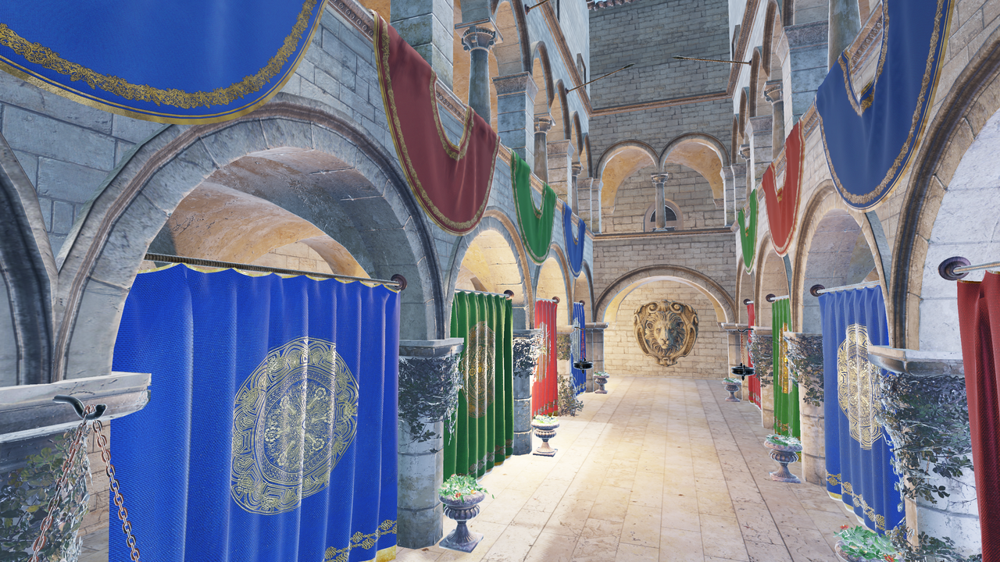
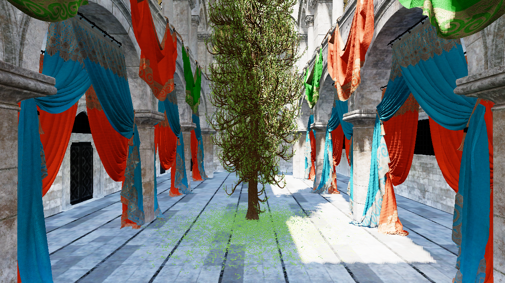
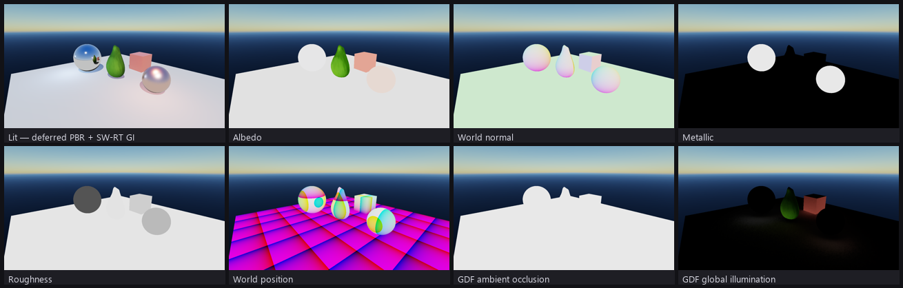

# DreamCoast

> A from-scratch Rust graphics engine on raw **Vulkan + D3D12 + Metal** — built as a
> human–AI pair-programming experiment.



DreamCoast is a custom renderer layered directly on **raw Vulkan (`ash`)**, **raw
Direct3D 12 (`windows-rs`)**, and **raw Metal (`objc2`)** behind one hand-rolled,
bindless-first RHI — no `wgpu`, no engine framework. The point is to understand explicit
GPU APIs (sync, descriptors, bindless, a render graph, ray tracing) by implementing them
by hand and keeping all three backends byte-for-byte in agreement.

**Backend parity is a hard rule:** every change must produce identical output on Vulkan
and D3D12 (≤ 0.001 avg/channel, verified on an RTX 2070 SUPER); Metal is at near-full parity.

## What's in it

- **Deferred PBR** — Cook-Torrance, shadow maps, image-based lighting.
- **Physically-based lighting** — sun authored in **lux**, a physical-camera **EV100**
  exposure (+ optional auto-exposure), and an atmospheric sky.
  See [`docs/physical-lighting.md`](docs/physical-lighting.md).
- **Software-RT global illumination** — a baked global distance field drives AO,
  1-bounce + multibounce diffuse GI (a DDGI-lite world irradiance volume), and hybrid
  SW-RT reflections (SSR + GDF + sky), now the default ambient. A mesh-card surface cache
  and a `RenderQuality{low,med,high}` tier sit on top.
  See [`docs/scalable-gi.md`](docs/scalable-gi.md), [`docs/gi-radiance-cache.md`](docs/gi-radiance-cache.md).
- **Hardware ray tracing** — DXR + `VK_KHR_ray_tracing`, inline `RayQuery` and a full
  RT pipeline; a path tracer is the ground-truth parity reference. SW-RT is the default at
  every quality tier — HW-RT is a separate, explicit option (`--raytracing`).
- **Render graph** — per-frame graph with transient-resource aliasing; every technique
  hangs off it.
- **Cooked assets** — meshes, scene SDF/albedo bakes, and BCn-compressed textures cook to
  one deterministic `.dcasset`; a self-made ECS + glTF hierarchy import, RON levels, and
  camera-driven chunk streaming. Convention: **1 unit = 1 metre**.
- **Multithreaded frame** — a from-scratch work-stealing **job system**, a fixed-timestep
  sim loop, a parallel ECS schedule, and a 레퍼런스식 **render-graph ↔ RHI thread split** with
  1-frame overlap + parallel pass recording (`P15_RHI_THREAD` / `P15_PARALLEL_RECORD`).
- **glTF animation** — node TRS clips (all 3 interpolation modes), **GPU vertex skinning**
  (vertex-pulling, Metal+VK+D3D12) + skinned shadows, and morph targets — driven from the
  ECS (`SCENE_GLTF=<gltf> GLTF_ANIM`).
- **Virtual geometry** — a Nanite-style cluster/LOD-DAG pipeline: meshes are split into
  meshlets with a QEM-simplified LOD DAG, a compute cut selects a crack-free continuous LOD,
  and an R64 **visibility buffer** is filled by a HW mesh-shader path (large triangles) and a
  compute software rasterizer (micro-triangles), then resolved into the same deferred G-buffer.
  Per-triangle backface culling honours glTF `doubleSided`. A drop-in G-buffer producer, byte-
  matching the mesh fill (`P14_VGEO=1 P14_VGEO_BIN=1`).
  See [`docs/phase-14-vgeo-lod-soffit-fix.md`](docs/phase-14-vgeo-lod-soffit-fix.md).



## Graphics features at a glance

The deferred pipeline writes a four-target G-buffer, then a full-screen pass shades it with
Cook-Torrance PBR plus software-ray-traced ambient (a baked global distance field drives AO
and one-bounce diffuse GI). Every channel is inspectable at runtime via `DEBUG_VIEW`:



Phases 0–12 are complete, plus the Phase 15 multithread core (M1–M4: job system →
render/RHI thread split → parallel recording) and glTF **animation** (node + skinning +
morph). The full plan — including the Phase 15+ runtime/tooling layer and the macOS Metal
backend — is in [`docs/ROADMAP.md`](docs/ROADMAP.md), with a reviewed design doc per phase
in [`docs/`](docs/) (animation: [`docs/animation.md`](docs/animation.md)).

## Built with an AI agent

Every milestone is designed and — once approved — implemented **together with
[Claude Code](https://claude.com/claude-code)** as a pair programmer: the human sets
direction, reviews, and decides trade-offs; the agent explores the codebase, writes the
implementation, runs both backends, and keeps the plans honest. The reviewed plans and
per-phase commits are part of the artifact — a case study in AI-assisted systems
programming on a project that doesn't fit in a single prompt.

## Build & run

```bash
# Windows
cargo run -p sandbox -- --backend vulkan      # or: --backend d3d12

# macOS (defaults to Metal)
cargo run -p sandbox -- --backend metal

# Hardware ray tracing (DXR / VK_KHR path tracer). The default renderer is software-RT
# (GDF) at every quality tier; HW-RT is a separate, explicit option:
cargo run -p sandbox -- --backend d3d12 --raytracing
```

Shaders compile from a single Slang source to SPIR-V + DXIL + metallib via `slangc`
(resolved from `tools/slang/`, `SLANGC`, or `PATH`). Sample glTF assets (CC0) are fetched
at runtime, not committed: `tools/fetch-assets.sh` or `pwsh tools/fetch-assets.ps1`. All
developer tooling (asset/layer fetchers, shader compilers, the raster-vs-path-tracer diff,
the RenderDoc MCP server) is documented in [`tools/README.md`](tools/README.md); macOS /
Metal setup is in [`docs/metal-backend.md`](docs/metal-backend.md).

## Tech stack

| Area | Choice |
|------|--------|
| Language | Rust (cargo workspace, edition 2024) |
| Vulkan / D3D12 / Metal | `ash` · `windows-rs` · `objc2` (all raw) |
| RHI | hand-rolled, enum-dispatch, bindless-first |
| Shaders | Slang → SPIR-V + DXIL + metallib (single source) |
| UI · Math | Dear ImGui (custom RHI renderer) · `glam` |

## Workspace layout

```
crates/  core · platform · shader · rhi-types · rhi-{vulkan,d3d12,metal} · rhi · gui · asset · render
apps/    sandbox   # technique playground executable
```

The engine crates carry the `dreamcoast-` prefix; the `rhi-*` crates are the Render
Hardware Interface layer. Planned crates for later phases (`anim`, and the Phase 15+
`jobs`/`physics`/`audio`/`script`/`net`/`ui`/`vfx`/`ai` facades + a standalone editor) are
described in [`docs/ROADMAP.md`](docs/ROADMAP.md).

## License

[MIT](LICENSE). Third-party licenses are in [THIRD_PARTY_LICENSES.md](THIRD_PARTY_LICENSES.md).
