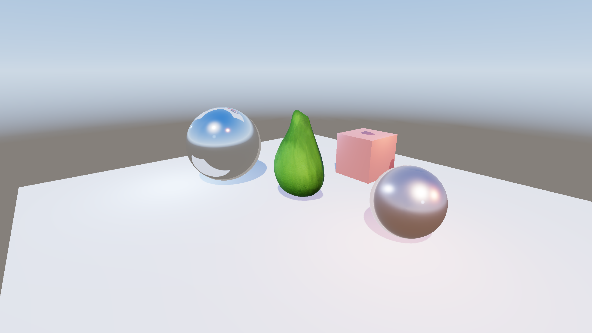
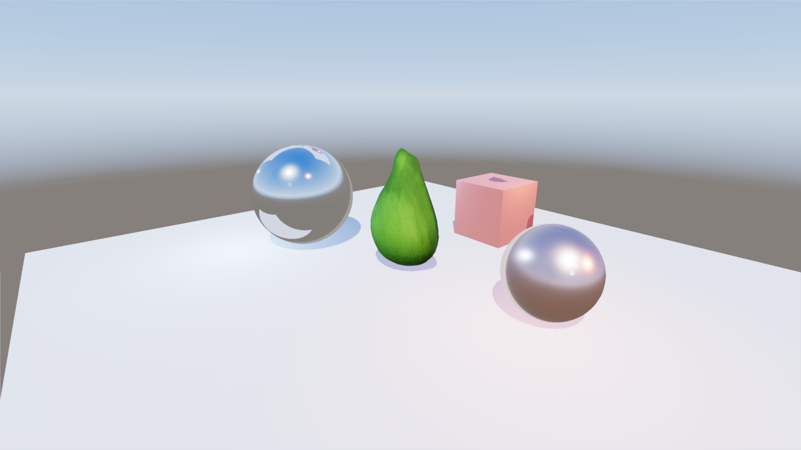
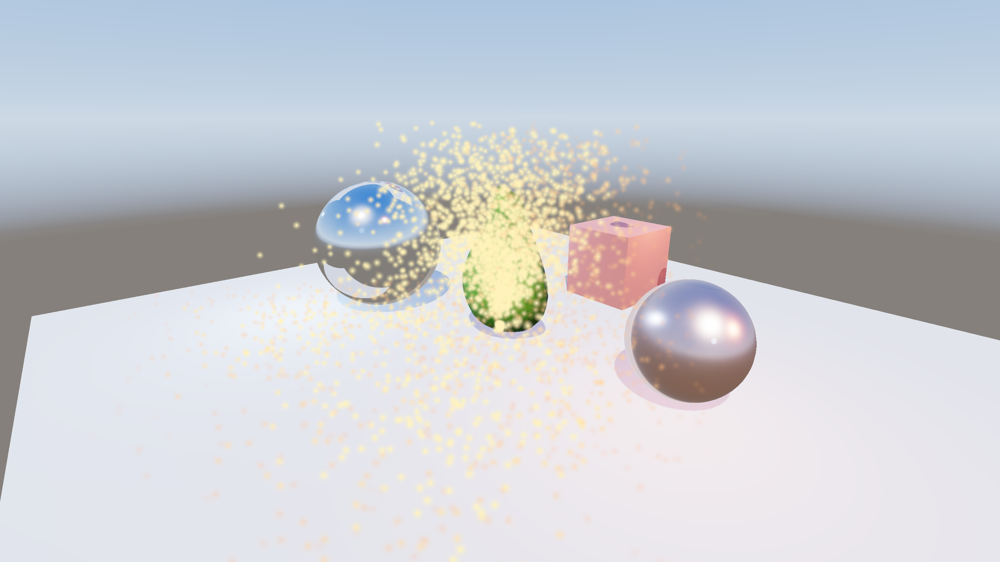
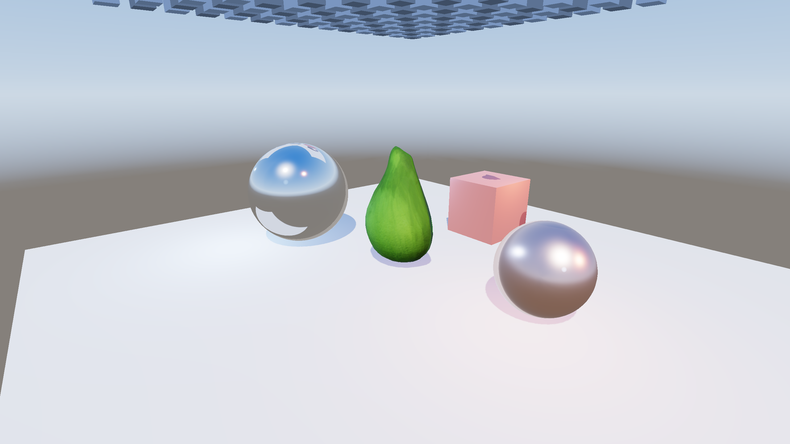
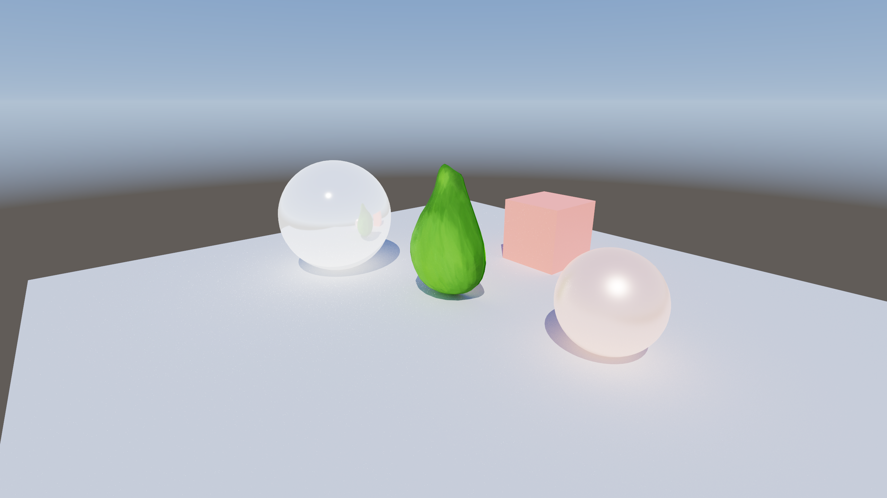

# Metal backend (macOS)

A native Metal RHI backend (`crates/rhi-metal`) so the engine runs on macOS
alongside the Windows Vulkan / D3D12 backends, sharing the same enum-dispatch
`rhi` facade, render graph, GUI, and assets. Parity: **through Phase 7**
(triangle → mesh → PBR deferred → compute/async/indirect) **plus Phase 8 inline
ray tracing** (M6, below) — `Device::has_raytracing()` is now `true` on RT-capable
Apple GPUs. M7 adds an experimental DXR-style RT-pipeline path via **Metal Shader
Converter**: raygen becomes a compute kernel, miss/closest-hit are called through
`MTLVisibleFunctionTable`, and the hit-group bridge uses
`MTLIntersectionFunctionTable`. The inline `RayQuery` path remains the default and
fallback.

## Platform layout

- **Windowing** (`crates/platform`): Win32 on Windows, hand-rolled Cocoa/AppKit on
  macOS (`window_macos.rs`) — an `NSWindow` whose content view is layer-backed by a
  `CAMetalLayer`, exposed via `Window::metal_layer()`.
- **Backends are OS-gated.** The `rhi` facade compiles `Vulkan`+`D3d12` on Windows
  and `Metal` on macOS (per-arm `#[cfg]`). `rhi-vulkan` / `rhi-d3d12` are
  `#![cfg(windows)]` (empty elsewhere) so `cargo build` works on macOS;
  `rhi-metal` is macOS-only.

## Toolchain setup (macOS)

Two tools are needed to compile shaders to Metal:

1. **Xcode + Metal Toolchain.** Slang's `-target metallib` shells out to Apple's
   `metal` compiler, which ships in the **Metal Toolchain** under `Xcode.app` — *not*
   the standalone Command Line Tools. Install full Xcode plus the toolchain component:
   ```sh
   xcodebuild -downloadComponent MetalToolchain
   xcrun metal --version   # verify
   ```
   You do **not** need to `xcode-select` onto Xcode: `build.rs` auto-discovers a
   developer dir that provides `metal` (see below), so a checkout builds even when
   `xcode-select` is left pointing at the Command Line Tools.
2. **Slang (`slangc`).** Download the macOS build and place it under
   `tools/slang/` (gitignored), or point `SLANGC` at it, or add it to `PATH`:
   ```sh
   curl -fsSL -o /tmp/slang.tar.gz \
     https://github.com/shader-slang/slang/releases/download/v2026.11/slang-2026.11-macos-aarch64.tar.gz
   mkdir -p tools/slang && tar -xzf /tmp/slang.tar.gz -C tools/slang
   tools/slang/bin/slangc -v   # verify
   ```

`crates/shader/build.rs` resolves `slangc` (SLANGC → `tools/slang/bin/slangc` →
PATH → `VULKAN_SDK`) and, on macOS, compiles each shader to a `.metallib` via
Slang's Metal target (which shells out to `metal`). If `slangc` or the Metal
toolchain is absent the build still succeeds — shader accessors just return `None`.

**`metal` discovery (macOS).** Because the `metal` compiler lives under `Xcode.app`
rather than the Command Line Tools, `build.rs` locates it without requiring an
`xcode-select` switch: if `metal` is not already reachable (`xcrun --find metal`) and
`DEVELOPER_DIR` is not preset, it probes `xcode-select -p`, then
`/Applications/Xcode.app` and `/Applications/Xcode-beta.app`, and sets `DEVELOPER_DIR`
on the slangc invocation to the first dir whose `metal` resolves (printing one
`cargo:warning` naming the dir it picked). Overrides: set `DEVELOPER_DIR` explicitly,
or make it durable system-wide with
`sudo xcode-select -s /Applications/Xcode.app/Contents/Developer`. When no dir
provides `metal` (toolchain not installed), the metallib targets degrade to `None`
accessors as above and the Metal backend can't run those shaders at runtime.

## Assets

Sample glTF models (CC0) are fetched at runtime, not committed. On macOS:
```sh
tools/fetch-assets.sh    # Avocado (default model.glb), BoomBox, Lantern
```
(Windows: `pwsh tools/fetch-assets.ps1`.)

## Running

```sh
cargo run -p sandbox -- --backend metal --clear-test          # M0 clear loop
cargo run -p sandbox -- --backend metal --clear-test --frames 60   # headless smoke test
cargo run -p sandbox -- --backend metal --triangle-test       # M2 RGB triangle
cargo run -p sandbox -- --backend metal --triangle-test --frames 60   # headless
cargo run -p sandbox -- --backend metal --triangle-test --screenshot tri.png  # capture + exit
cargo run -p sandbox -- --backend metal --mesh-test           # M3 textured bindless mesh + ImGui
cargo run -p sandbox -- --backend metal --mesh-test --screenshot mesh.png  # capture + exit
cargo run -p sandbox -- --backend metal                        # M4 full deferred-PBR scene
cargo run -p sandbox -- --backend metal --screenshot scene.png # M4 scene + ImGui, capture + exit
cargo run -p sandbox -- --backend metal --screenshot-clean scene.png  # M4 scene, 3D only
```

The flagless real renderer (M4) needs `assets/model.glb` (`tools/fetch-assets.sh`).
The Phase-7 compute demos (M5) are cross-backend env toggles on the real scene:
```sh
P7_COMPUTE_POST=1 cargo run -p sandbox -- --backend metal --screenshot-clean post.png  # compute blur
P7_PARTICLES=1    cargo run -p sandbox -- --backend metal --screenshot-clean parts.png # GPU particles
P7_CULL=1         cargo run -p sandbox -- --backend metal --screenshot-clean cull.png  # GPU cull + indirect
P7_PARTICLES=1 ASYNC_COMPUTE=1 cargo run -p sandbox -- --backend metal --screenshot-clean async.png
```

`--triangle-test` and `--mesh-test` are cross-backend
(`--backend vulkan|d3d12|metal`); enable the Metal validation layers for a stricter
smoke test:
`MTL_DEBUG_LAYER=1 MTL_SHADER_VALIDATION=1 cargo run -p sandbox -- --backend metal --mesh-test --screenshot mesh.png`.

## Screenshots

Captured on the Apple Silicon M3 box via `--backend metal --screenshot-clean` under
`MTL_DEBUG_LAYER=1 MTL_SHADER_VALIDATION=1`.

**M4 — deferred-PBR scene** (shadow → G-buffer → IBL → lighting → tonemap):



**M5 — Phase-7 compute demos** (`P7_COMPUTE_POST` / `P7_PARTICLES` / `P7_CULL`):

| Compute post-process | GPU particles | GPU cull + indirect draw |
| --- | --- | --- |
|  |  |  |

(The `P7_PARTICLES=1 ASYNC_COMPUTE=1` async-compute path renders the same fountain as
the single-queue particle path.)

**M7 — RT pipeline via Metal Shader Converter** (`P8_PATHTRACE=1 P8_PATHTRACE_PIPELINE=1`):



## Milestone status

- **M0 — skeleton/clear:** done. Cocoa window + `CAMetalLayer` swapchain +
  acquire→clear→present verified.
- **M1 — Slang→metallib:** done. `build.rs` emits `*_metallib` accessors; the
  triangle and most vertex shaders compile. **Bindless blocker (resolved for
  `mesh`/`imgui` in M3):** loose unbounded `g_textures[]` / `g_cubes[]` arrays fail
  Metal compilation — *"flexible array member … is not at the end of struct"*. The
  fix is a bounded `ParameterBlock` (see M3 below). The cube/storage shaders still
  carry the loose-global form and stay `None`-on-metallib until they migrate in
  M4/M5.
- **M2 — triangle:** done. `MTLRenderPipelineState` from per-stage metallib
  blobs (`MTLLibrary` via `dispatch_data_t`, entry by name), host-visible
  `MTLBuffer` (vertex/index/uniform), vertex descriptor for every `VertexLayout`,
  viewport/scissor, draw / draw_indexed, and push constants. Screenshot readback
  (`copy_swapchain_to_buffer` blit + `MetalBuffer::read_into`, originally tagged
  M6) was pulled forward so `--triangle-test --screenshot <path>` captures the
  rendered frame to a PNG — automated pixel verification with no display. The
  layer is set non-`framebufferOnly` so its drawable can be a blit source. Verified
  by `--triangle-test` under the Metal API + GPU validation layers. **Binding
  convention:** push constants are bound at buffer index 0 (`setVertex/Fragment
  Bytes`) — Slang's `[[buffer(0)]]` when no globals/bindless precede them — and the
  vertex buffer at index `30`. The globals (M4) and bindless (M3) paths shift
  Slang's index assignment and will revisit this; see `resources.rs`.
- **M3 — bindless + textures + ImGui:** done. The `mesh.slang` / `imgui.slang`
  bindless arrays were migrated to a shared `ParameterBlock` (`bindless.slang`),
  which compiles to a Metal argument buffer; `MetalDevice` builds a tier-2 argument
  buffer (`MTLResourceID` handles, no encoder), `create_texture` /
  `create_depth_buffer` upload + register into it, depth testing got an
  `MTLDepthStencilState`, and `gui` (already RHI-agnostic) renders on Metal once its
  metallib accessors were wired. Verified by `--mesh-test --screenshot` (textured
  Avocado + ImGui overlay) under the Metal API + GPU validation layers. **Details +
  the cross-backend decision are below.**
- **M4 — render targets + PBR:** **done.** The full deferred-PBR render graph runs
  on Metal — `--backend metal --screenshot` of the real scene (shadow → G-buffer →
  IBL capture/convolve → lighting → tonemap, + ImGui) renders correctly and clean
  under `MTL_DEBUG_LAYER=1 MTL_SHADER_VALIDATION=1`. See "M4 plan + progress" below.
- **M5 — compute / async compute / indirect draw:** **done.** All three Phase-7
  compute demos run on Metal — compute post-process (HDR→storage-image blur→sample),
  GPU particles (compute sim → vertex-pull billboard draw), and GPU frustum culling
  (compute cull → `draw_indexed_indirect`) — plus real **async compute** (a dedicated
  `MTLCommandQueue` with `MTLSharedEvent` cross-queue sync). Verified clean under the
  validation layers; see "M5 plan + progress" below.
- **M6 — Phase 8 inline ray tracing:** **done.** Hardware AS build
  (`MTLPrimitiveAccelerationStructureDescriptor` BLAS per mesh +
  `MTLInstanceAccelerationStructureDescriptor` TLAS, `crates/rhi-metal/src/accel.rs`),
  the TLAS bound into the bindless argument buffer's `tlas` slot, and the inline
  `RayQuery` path tracer (`rt_path.slang`) + RT-shadow/instance debug
  (`rt_trace.slang`) all run on Metal — including the **RT-PBR G1/G2** Cook-Torrance
  BSDF + GGX reflections, which ride along through the shared `rt_common.slang`.
  Verified: outdoor scene (sun + sky + diffuse GI + reflections), Cornell box
  (emissive-ceiling color-bleed GI), and RT soft shadows, all clean under
  `MTL_DEBUG_LAYER=1 MTL_SHADER_VALIDATION=1`. At M6, the DXR-style RT pipeline +
  SBT path was still disabled on Metal because Slang's direct Metal target rejects
  all three DXR stages (`DispatchRaysIndex` /
  `BuiltInTriangleIntersectionAttributes` / `WorldRayDirection`); M7 below adds the
  Metal Shader Converter route for that pipeline. See "M6 plan + progress" below.

## Resume notes for M4+ (implementation pointers)

State to know when picking this up in a fresh session:

- **Toolchain is installed.** `slangc` at `tools/slang/bin/slangc` (v2026.11,
  gitignored); Metal toolchain downloaded (`xcrun metal` works). `model.glb`
  (Avocado) is in `assets/`.
- **Reference backend:** mirror `crates/rhi-vulkan` (its dynamic-rendering style is
  closest to Metal). The exact method contract every Metal type must satisfy is the
  `Metal(...)` arms in `crates/rhi/src/lib.rs`.
- **Current stubs:** `crates/rhi-metal/src/{device,command,resources}.rs` have
  `unimplemented!("…milestone Mx")` markers for everything past M3. Implemented:
  M0 (instance/device/swapchain/clear/fence/semaphore/queue submit+present),
  M2 (graphics pipelines, buffers, draw path), and M3 (bindless argument buffer,
  textures + depth, depth-stencil state, ImGui). M4 next: offscreen render targets,
  cubemaps, transient heap/aliasing, globals UBO, the MRT/render-graph passes — plus
  migrating the cube/storage shaders to `ParameterBlock` (they land at a different
  set/buffer index than `mesh`/`imgui`; see the M3 bindless section).
- **objc2 0.3 notes:** most property getters/setters are *safe* (no `unsafe`); the
  few that need `unsafe` (e.g. `NSWindow::setReleasedWhenClosed`,
  `objectAtIndexedSubscript`, the `setVertexBytes`/`drawPrimitives` family) the
  compiler will flag — let it guide you. Protocol methods need the protocol trait
  in scope (e.g. `MTLCommandEncoder` for `endEncoding`, `MTLLibrary` for
  `newFunctionWithName`). `presentDrawable` was called via `msg_send!` to avoid the
  `CAMetalDrawable`→`MTLDrawable` protocol-cast dance.

### M2 facts resolved (reuse for M3+)
- **MTLLibrary from bytes:** `device.newLibraryWithData_error(&DispatchData::from_bytes(blob))`
  (from the `dispatch2` crate — copies the blob, so `'static` shader bytes are
  fine). No temp file needed. See `pipeline.rs::load_function`.
- **Entry names:** Slang's Metal target *preserves* the entry name (`vsMain` /
  `fsMain`), so `library.newFunctionWithName("vsMain")` works directly.

### M3 bindless (done) — what shipped, and the cross-backend decision

**Shader model: a shared `ParameterBlock<Bindless>` in `bindless.slang`**, included
by `mesh.slang` + `imgui.slang` (the only bindless shaders Metal compiles in M3).
It compiles to a Metal argument buffer, a Vulkan descriptor set, and a D3D12
descriptor table from one source:

```hlsl
struct Bindless { Texture2D textures[1024]; SamplerState samp; };
[[vk::binding(0, 0)]] ParameterBlock<Bindless> g;   // usage: g.textures[i].Sample(g.samp, uv)
```

**Why only `mesh` + `imgui` migrated (not all 10 bindless shaders).** Empirically
(via `slangc` reflection + `spirv-asm`, Slang 2026.11): a `ParameterBlock` with **no
globals present** lands at **descriptor set 0** with `textures`=binding 0,
`samp`=binding 1 — *byte-identical* to the previous loose-global layout, so
**`rhi-vulkan` is unchanged** and the shared `bindless_set` still matches every
shader (migrated or not). `mesh`/`imgui` have no globals, so they qualify. The
globals-using shaders (`pbr`, `gbuffer`, `capture`, `prefilter`, `irradiance`,
`blur`, `post`, …) are **not** Metal targets until M4/M5; when they migrate, note
that a loose globals `ConstantBuffer` at set 1 **bumps** the `ParameterBlock` to set
2 — so *that* migration is the bigger cross-backend change the original spike warned
about. Defer it to the milestone that needs it.

**Pins that matter (verified, don't re-walk):**
- `[[vk::binding(0, 0)]]` on the **block** pins it to set 0 even though the push
  constant declares `register(b0, space0)` (which otherwise reserves space 0 and
  bumps the block to set 1). Pinning the *inner members* (`[[vk::binding]]` or
  `register()` on `textures`/`samp`) instead **bumps the whole block's space** —
  don't.
- The sampler must live **inside** the block (a ParameterBlock owns its whole
  descriptor set; a loose sampler can't share set 0). On Vulkan this is still set 0 /
  binding 1 (matches the old immutable sampler). The original spike's unbounded
  loose-global attempts and `DescriptorHandle<T>` both failed on the Metal target —
  the bounded ParameterBlock is the only path.

**Windows parity is NOT verified (macOS-only box).** SPIR-V is confirmed unchanged
here (so Vulkan should need no change). **D3D12: the sampler moves from a static
sampler into the bindless table** (a ParameterBlock sampler is a table entry), so
`rhi-d3d12`'s root signature for `imgui`/`mesh` needs that tweak — **verify on the
RTX 2070 SUPER**. DXIL can't be compiled on macOS (no DXC), so this could not be
checked in the M3 session.

**Metal argument buffer (tier-2, no encoder).** Apple Silicon → argument buffers
tier 2: `DeviceShared` allocates a shared `MTLBuffer` and writes 8-byte
`MTLResourceID` handles directly — texture slots `0..BINDLESS_COUNT`, the shared
sampler at slot `BINDLESS_COUNT` (Slang's id for `samp`). `create_texture` /
`create_depth_buffer` register handles; `bind_graphics_pipeline` binds the buffer at
`[[buffer(1)]]` for bindless pipelines and `useResource`s the sampled textures
(argument-buffer resources need explicit residency). See `device.rs` (`register` /
`write_handle`) and `command.rs` (`bind_graphics_pipeline`).

**Gotcha — sampler in an argument buffer needs `supportArgumentBuffers`.** The shared
sampler is encoded into the bindless argument buffer via `sampler.gpuResourceID()`, so
its `MTLSamplerDescriptor` **must** set `setSupportArgumentBuffers(true)` (`device.rs`).
Without it the resource ID is invalid for argument-buffer use; the symptom is silent
until you run under the validation layers, where
`MTL_DEBUG_LAYER=1 MTL_SHADER_VALIDATION=1` faults on the sampler slot. Always smoke-test
Metal changes with both flags on (see "Running"/"Screenshots").

**Buffer-index map (M3):** push constants `[[buffer(0)]]` (`PUSH_CONSTANT_INDEX`),
bindless argument buffer `[[buffer(1)]]` (`BINDLESS_BUFFER_INDEX`), vertex buffer at
30. Globals (M4) will take the next low index and shift the bindless slot for the
globals-using shaders (their block is at set 2 / `[[buffer(2)]]`).

**Gotchas hit in M3 (reuse):**
- A depth-less pipeline (ImGui) **cannot** be bound in a render pass that has a depth
  attachment — Metal validates the pipeline's `depthAttachmentPixelFormat` against
  the pass. `--mesh-test` runs the mesh in a depth pass, then ImGui in a second
  color-load pass (mirrors the engine's geometry-then-UI structure).
- Metal validates `setBytes` length against the shader argument's *alignment-padded*
  size (ImGui's `{float2, float2, uint}` is 20 bytes of data but Metal wants 24).
  `command.rs::push_constants` rounds the upload up to 16 to always cover the pad.

## M4 plan + progress

**Goal / done-when:** the full deferred-PBR render graph runs end-to-end on Metal
— `cargo run -p sandbox -- --backend metal --screenshot scene.png` produces the same
shadowed + IBL-lit result as Vulkan, clean under `MTL_DEBUG_LAYER=1
MTL_SHADER_VALIDATION=1`. Compute/culling/particles/indirect/storage buffers stay M5.

**Ordered steps** (each verified by a cross-backend `--*-test` flag, mirroring M0–M3):

1. **Shader migration to `ParameterBlock` (the cross-backend risk — do first,
   independently). — DONE (see progress log).** The M4 shaders were loose-global so
   `metallib` failed → `None` accessors. Migrated `gbuffer`, `pbr`, `capture`,
   `irradiance`, `prefilter`, `post`, `blur` (`brdf`/`sky`/`shadow` had no bindless
   resources and already compiled). Sub-points:
   - Add `TextureCube cubes[N]` to the `Bindless` struct in `bindless.slang` (pbr
     samples `g_cubes[]` at a separate `space1` today — fold it into the block).
   - **Globals-using shaders: block stays Vulkan set 0, Metal `[[buffer(2)]]`.**
     ~~A loose globals `ConstantBuffer` at set 1 pushes the `ParameterBlock` to set
     2.~~ *Corrected empirically during the `pbr` migration (Slang 2026.11):* the
     `[[vk::binding(0,0)]]` pin holds the block at **descriptor set 0** even with the
     globals UBO at set 1, so the Vulkan layout is byte-for-byte the old loose-global
     one (textures b0, samp b1, cubes b2 on set 0; globals set 1) — **`rhi-vulkan`
     untouched**. Only the *Metal buffer index* shifts: the globals UBO takes
     `[[buffer(1)]]`, pushing the bindless argument buffer to `[[buffer(2)]]` (vs
     `[[buffer(1)]]` for non-globals shaders). `pbr.slang` has globals; the IBL gen
     shaders mostly drive cube faces via push constants — check each.
   - After every shader: `slangc -target spirv-asm` and confirm the **descriptor
     set/binding layout is unchanged** (Vulkan safe). It will NOT be byte-identical:
     the array goes unbounded→`[1024]` and `RuntimeDescriptorArray` /
     `SPV_EXT_descriptor_indexing` drop out — *exactly the M3 mesh/imgui change*, so
     same risk profile (Vulkan/D3D12 parity pending the Windows RTX 2070 SUPER box).
2. **Globals UBO path.** `MetalDevice::set_globals_buffer` (store the buffer in
   `DeviceShared`), `MetalCommandBuffer::set_globals(offset)` (stash offset in a
   `Cell`, bind globals buffer in `bind_graphics_pipeline` at a new
   `GLOBALS_BUFFER_INDEX`). Add a `uses_globals` flag to `MetalGraphicsPipeline`.
   Update the buffer-index map in `resources.rs` (push 0, globals 1, bindless block 2
   for globals shaders, vertex 30).
3. **Offscreen render targets + MRT.** `MetalRenderTarget` =
   `MTLTexture{RenderTarget|ShaderRead, Private}` + bindless slot; `create_render_target`;
   `begin_rendering_target` / `begin_rendering_targets` (G-buffer = 4 color
   attachments). Barriers (`rt_to_sampled` etc.) likely stay no-ops — Metal's
   encoder-boundary hazard tracking handles read-after-write; confirm with validation.
4. **Shadow pass.** `begin_rendering_depth_only` (depth attachment only, store
   action `Store` — M3 used `DontCare`), then sample the depth in `pbr` (register the
   M3-reserved depth slot for residency in `depth_to_sampled`).
5. **Cubemaps + IBL.** `MetalCubemap` = `MTLTextureType::Cube`, 6 layers, mipped.
   Metal is simpler than the Vulkan per-(face,mip) views: render via the color
   attachment's `setSlice(face)` + `setLevel(mip)` directly. Wire
   `begin_rendering_cube_face[_depth]`, `mip_levels`, `mip_size`.
6. **Transient heap / aliasing + post.** Use `MTLHeapType::Placement` so Vulkan's
   offset model maps 1:1: `heapTextureSizeAndAlign` → `render_target_memory`,
   `heap.newTexture(descriptor, offset:)` → `create_aliased_target`. Then post
   (tonemap/bloom) and the full deferred scene runs.

Suggested verification flags: `--gbuffer-test`, `--shadow-test`, `--ibl-test`, then
the flagless real renderer. All cross-backend (`--backend vulkan|d3d12|metal`).

### M4 progress log

- **Step 1 — `gbuffer.slang` migrated (done, verified on this macOS box).** Replaced
  the loose `g_textures[]` / `g_sampler` with `#include "bindless.slang"` + `g.textures[]`
  / `g.samp` (no globals → block stays at **set 0**, like mesh/imgui). Verified:
  `gbuffer_{vs,fs}_metallib()` now return `Some` (were `None`); `dreamcoast-shader`
  builds clean. SPIR-V: **VS byte-identical**, **FS descriptor layout identical**
  (set 0, binding 0 = textures, binding 1 = sampler) with the bounded-array /
  dropped-`SPV_EXT_descriptor_indexing` change noted above. **Vulkan/D3D12 parity
  pending the Windows box** (same as M3).

- **Step 1 — `cubes[]` folded into `Bindless` + `pbr.slang` migrated (done,
  verified on this macOS box).** Added `TextureCube cubes[64]` to the shared
  `Bindless` struct (matches `CUBE_COUNT` in `rhi-vulkan`); the cube array now lives
  inside the block instead of a separate loose `g_cubes[]` at `space1`. `pbr.slang`
  switched to `#include "bindless.slang"` — `g.textures[]` / `g.cubes[]` / `g.samp`
  — and its globals UBO renamed `g`→`globals` (the block owns the name `g` and the
  whole set). Verified:
  - `pbr_{vs,fs}_metallib()` now return `Some` (`pbr_fs` was `None`).
  - **The globals→set-2 prediction was wrong** (see step 1 above): `pbr_fs` SPIR-V is
    **identical to the loose-global baseline** — block at set 0 (textures b0, samp b1,
    cubes b2), globals at set 1 — so `rhi-vulkan` needs no change. Metal MSL confirms
    `pc`=`buffer(0)`, `globals`=`buffer(1)`, bindless block=`buffer(2)`.
  - **No regression** from the shared-struct change: `mesh`/`imgui`/`gbuffer` SPIR-V
    stays at (set 0, textures b0, samp b1) — Slang drops the unused cube binding —
    and all still compile to `metallib`.
  - **Vulkan/D3D12 parity pending the Windows RTX 2070 SUPER box** (same risk profile
    as M3: bounded array + dropped `SPV_EXT_descriptor_indexing`; D3D12 sampler-in-
    table). Next: remaining step-1 shaders (`capture`, `irradiance`, `prefilter`,
    `brdf`, `sky`, `shadow`, `post`, `blur`) — `capture`/`irradiance`/`prefilter`
    still fail `metallib` on the loose `g_cubes[]`, the same fix applies. Then step 2
    (Metal globals-UBO path: bind globals at `buffer(1)`, bindless at `buffer(2)` for
    `uses_globals` pipelines).

- **Step 1 — COMPLETE: remaining shaders migrated (done, verified on this macOS
  box).** Migrated the last loose-global shaders to `#include "bindless.slang"`:
  - `post` / `blur`: `g_textures[]`+`g_sampler` → `g.textures[]`/`g.samp` (no
    cubes/globals, exactly like `mesh`/`imgui`).
  - `capture`: `g_textures[]`+`g_sampler`+`g_cubes[]` → `g.textures[]`/`g.cubes[]`/
    `g.samp` (no globals UBO — it drives faces via push constants).
  - `irradiance` / `prefilter`: `g_sampler`+`g_cubes[]` → `g.samp`/`g.cubes[]`. These
    use **only** the sampler + cube array (not `textures`), so the unused `textures`
    member sits *before* the used ones in the block. **Verified the block still
    reserves the full descriptor set:** `samp` stays at binding 1 and `cubes` at
    binding 2 (Slang does **not** compact the unused leading binding away) — SPIR-V
    descriptor layout byte-for-byte the loose-global baseline. This was the one real
    layout risk in step 1 and it held.
  - `brdf` / `sky` / `shadow` have **no** bindless resources (push constants only) and
    already compiled to `metallib` — no change, confirmed `Some`.

  Verified on this box: `post`/`blur`/`capture`/`irradiance`/`prefilter` `_fs_metallib`
  now return `Some` (were `None`); full `cargo build` clean. SPIR-V: every migrated
  shader's set/binding layout is **identical to its pre-migration baseline** (captured
  via `slangc -target spirv-asm` before/after) — only the member name changed
  (`g_sampler`→`g_samp`), with the same bounded-array / dropped-
  `SPV_EXT_descriptor_indexing` change as M3. Metal MSL confirms these non-globals
  shaders bind push constants at `[[buffer(0)]]` and the bindless argument buffer at
  `[[buffer(1)]]` (the M3 `BINDLESS_BUFFER_INDEX`). **The only `metallib` `None`
  accessors left are the M5 compute/storage shaders** (`post_compute`, `particle_sim`,
  `particle_draw`, `cull`, `cull_draw` — loose `g_textures[]` + storage buffers,
  migrate in M5). **Vulkan/D3D12 parity pending the Windows RTX 2070 SUPER box** (same
  risk profile as M3). **Step 1 done; next is step 2 (Metal globals-UBO path).**

- **Steps 2–6 — DONE (deferred scene runs on Metal, verified on this box).**
  Implemented together in `rhi-metal` (+ a sandbox gate); all verified at once by the
  real `--backend metal --screenshot` deferred render, clean under
  `MTL_DEBUG_LAYER=1 MTL_SHADER_VALIDATION=1`.
  - **Step 2 — globals UBO.** `set_globals_buffer` stores the buffer in
    `DeviceShared`; `set_globals(offset)` stashes a byte offset in a `Cell`;
    `MetalGraphicsPipeline.uses_globals` (= `desc.uniform_buffer`) makes
    `bind_graphics_pipeline` bind the globals UBO at `GLOBALS_BUFFER_INDEX = 1` and
    shift the bindless argument buffer to `buffer(2)`
    (`BINDLESS_BUFFER_INDEX_WITH_GLOBALS`) — matching `pbr.slang`'s MSL.
  - **Step 3 — render targets + MRT.** `MetalRenderTarget` = `MTLTexture`
    (`RenderTarget | ShaderRead`, `Private`) registered in the texture table;
    `begin_rendering_target` / `begin_rendering_targets` (the 4-attachment G-buffer).
    No explicit barriers — Metal's encoder-boundary hazard tracking handles
    write→sample; the graph's `rt_to_*` hooks instead toggle **bindless residency**
    (see below).
  - **Step 4 — shadow pass.** `begin_rendering_depth_only` (depth attachment only,
    `Store`); `depth_to_sampled` makes the shadow map resident so `pbr` samples it as
    `g.textures[shadow_index]`.
  - **Step 5 — cubemaps + IBL.** `MetalCubemap` = `MTLTextureType::Cube` (6 faces,
    mipped) in the cube table (`bindless.slang` cube `i` → argument-buffer slot
    `BINDLESS_COUNT + 1 + i`; the argument buffer was enlarged by `CUBE_COUNT`).
    `begin_rendering_cube_face[_depth]` selects the subresource via the color
    attachment's `setSlice(face)` + `setLevel(mip)` (no per-(face, mip) view needed,
    unlike Vulkan). Sky → env (full mip chain) → scene capture → irradiance →
    prefilter all run; reflections + ambient match.
  - **Step 6 — transient heap / aliasing.** `render_target_memory` via
    `heapTextureSizeAndAlignWithDescriptor`; `create_transient_heap` =
    `MTLHeapType::Placement` + **`Tracked`** hazard mode (so aliasing/RAW hazards are
    automatic and `aliasing_barrier` stays a no-op); `create_aliased_target` =
    `heap.newTextureWithDescriptor:offset:`. The graph's default `aliasing = true`
    path is exercised.
  - **Bindless residency model (the one non-obvious design choice).** Render targets
    / cubemaps / shadow maps are both attachments (written) and bindless sampled
    (read), but Metal forbids `useResource` on a texture that is the current render
    target. So residency is **toggled by the render-graph transition hooks**:
    `*_to_sampled` adds a resource to the resident set (made resident at the next
    bindless `bind_graphics_pipeline`), `*_to_render_target` / `cube_to_color` /
    `aliasing_barrier` drop it before it is written. Static textures
    (`create_texture`) stay resident for the app's lifetime. This mirrors the Vulkan
    layout transitions 1:1 and never makes an attachment resident in its own pass.
  - **Sandbox gate.** The Phase-7 compute features (post blur / GPU particles / GPU
    culling) are M5 on Metal. `compute_supported = backend != Metal` forces those
    flags off, gates the particle seed dispatch + the `particle_draw` / `cull_draw`
    pipelines (their metallibs are still `None`), and `load_shader_pair` /
    `load_compute_shader` now feed the Metal path the `*_metallib()` accessors. The
    compute pipelines / storage buffers create as inert placeholders (never
    dispatched on Metal).
  - **Vulkan/D3D12 parity:** the shared shaders changed in step 1; steps 2–6 are
    Metal-backend-only Rust + a backend-neutral sandbox gate, so they do not alter the
    Windows backends. **Verified on the Windows RTX 2070 SUPER box** — commit
    `1d61ef4` aligned the D3D12 graphics root signature to the `ParameterBlock`
    `space1` bindless layout; Vulkan + D3D12 render the deferred-PBR scene
    pixel-identically to Metal.

## M5 plan + progress

**Goal / done-when:** the three Phase-7 compute demos + async compute run on Metal,
clean under `MTL_DEBUG_LAYER=1 MTL_SHADER_VALIDATION=1`, and the demos-off scene
matches M4 (regression). Phase 7 / async-compute were already shipped on Vulkan/D3D12
and the shaders + render-graph compute passes + sandbox wiring (toggles, ping-pong)
are backend-neutral, so M5 is mostly **filling the Metal backend stubs + migrating
the 5 compute shaders to `metallib`** — not new design.

**Done (verified on this macOS M3 box):**

- **Step 1 — compute shaders → `metallib`.** Folded `RWTexture2D storage_images[64]`
  (binding 3) + `RWByteAddressBuffer storage_buffers[64]` (binding 4) into the shared
  `Bindless` block in `bindless.slang`, and migrated `post_compute`, `particle_sim`,
  `particle_draw`, `cull`, `cull_draw` from loose `g_storage_*[]` globals to
  `g.storage_*[]`. All five now compile to `metallib` (were the last `None`
  accessors). **SPIR-V descriptor layout byte-identical to the loose-global baseline**
  (storage image stays set 0 / binding 3, storage buffer binding 4; only the sampler
  member name changed `g_sampler`→`g_samp`) — same risk profile as M3/M4. MSL: the
  argument-buffer struct is
  `textures[1024]/samp/cubes[64]/storage_images[64]/storage_buffers[64]` (no
  compaction); storage-image entries are `MTLResourceID`s, storage-buffer entries are
  `device` pointers (GPU addresses).

- **Step 2 — compute pipeline + dispatch.** `ComputePipelineDesc.threads_per_group`
  (MSL kernels don't bake `[numthreads]` in, unlike SPIR-V/DXIL; the sandbox fills it
  per shader — post 8×8×1, sim/cull 64×1×1, reset 1×1×1). `MetalComputePipeline` =
  `MTLComputePipelineState` + threadgroup size; `pipeline::build_compute`.
  `bind_compute_pipeline` ends any open encoder, opens a fresh
  `MTLComputeCommandEncoder`, binds the argument buffer at `BINDLESS_BUFFER_INDEX`
  (buffer(1) — no globals in compute) and makes storage resources resident.
  `dispatch` = `dispatchThreadgroups:threadsPerThreadgroup:`; `push_constants_compute`
  = `setBytes` (16-padded). **One encoder per `bind_compute_pipeline`** so consecutive
  compute passes (cull reset → cull) sit on separate encoders and Metal's automatic
  hazard tracking orders them (the `storage_buffer_*` barriers stay no-ops, like M4's
  encoder-boundary model).

- **Step 3 — storage resources (UAV).** Argument buffer enlarged by
  `STORAGE_IMAGE_COUNT + STORAGE_BUFFER_COUNT` (= 64 + 64); `register_storage_image`
  (writes the texture's `gpuResourceID`) / `register_storage_buffer` (writes the
  buffer's `gpuAddress` — tier-2 buffer entries are addresses, not resource IDs).
  `create_render_target` / `create_aliased_target` allocate a storage-image bindless
  slot when `desc.storage` (the `RenderTarget` already got `ShaderWrite` usage in M4);
  `create_storage_buffer` = `StorageModePrivate` `MTLBuffer` (GPU-seeded, no host
  upload). **Residency model:** storage buffers stay permanently resident
  (`Read|Write` on compute encoders, `Read` on the particle/cull draw vertex stage);
  storage images toggle into a `storage_resident` set via `rt_to_storage` /
  `storage_to_sampled` (the M4 sampled-residency hooks, extended). Barriers stay
  no-ops on the single queue.

- **Step 4 — indirect draw.** `draw_indexed_indirect` =
  `drawIndexedPrimitives:indexType:indexBuffer:…:indirectBuffer:indirectBufferOffset:`.
  Metal's `MTLDrawIndexedPrimitivesIndirectArguments` is the same 5×u32 / 20-byte
  layout the cull compute shader writes; `BufferUsage::Indirect` needs no special
  Metal flag (any private buffer is a valid indirect source). One call per command, so
  loop for `draw_count > 1` (cull uses a single args record).

- **Step 5 — ungate + demos.** `compute_supported = true` (all backends now support
  compute); `load_compute_shader` feeds the Metal path the `*_cs_metallib()`
  accessors. All three demos verified by `P7_* --screenshot-clean` + Read, clean under
  the validation layers; demos-off = M4 scene (regression).

- **Step 6 — async compute.** `MetalSemaphore` now wraps an `MTLSharedEvent` (+ a
  monotonic value); a dedicated compute `MTLCommandQueue` lives in `DeviceShared`;
  `has_async_compute()` = true; `create_compute_command_buffer` records onto the
  compute queue. `MetalComputeQueue::submit` ends the encoder, `encodeSignalEvent`s a
  fresh value, and commits on the compute queue. **Cross-queue wait:** Metal can only
  encode a wait into a command buffer's stream (no queue-level wait à la D3D12
  `queue->Wait`), and the graphics buffer is already fully recorded by `submit_async`
  time — so the wait goes on a tiny **leading** command buffer committed to the
  graphics queue *before* the real one (command buffers in a queue execute in commit
  order, so the graphics work doesn't start until the wait resolves). Verified
  `P7_PARTICLES=1 ASYNC_COMPUTE=1` — the fountain matches the single-queue path, no
  hazards, validation clean. The single-queue path (graph compute pass + `submit`) is
  preserved as the fallback.

- **Vulkan/D3D12 parity — VERIFIED on the Windows RTX 2070 SUPER box.** Only the
  step-1 shader change touches the shared shaders (same bounded-array /
  dropped-`SPV_EXT_descriptor_indexing` change as M3/M4; storage bindings unchanged);
  steps 2–6 are Metal-backend-only Rust + the backend-neutral `compute_supported =
  true` flip. As predicted, folding the storage arrays into the `ParameterBlock`
  required the D3D12 **compute** root signature to move to the `space1` bindless
  layout: commit `48e03d3` unified both (graphics + compute) root signatures on it
  (mirroring the M4 graphics fix `1d61ef4`). All three Phase-7 demos pass on Vulkan +
  D3D12, and that fix is `rhi-d3d12`-only (`cfg(windows)`) so it caused **no Metal
  regression** (re-verified on `main`). **All three backends are at Phase-7 parity.**

## M6 plan + progress (Phase 8 inline ray tracing)

**Goal / done-when:** the Phase 8 path tracer runs on Metal — AS build + TLAS trace
+ the inline `RayQuery` path tracer (`rt_path`) and the M3 RT-debug path
(`rt_trace`), including RT-PBR G1/G2 — clean under `MTL_DEBUG_LAYER=1
MTL_SHADER_VALIDATION=1`, demos-off scene unchanged (regression).

**Feasibility (slangc 2026.11):** the inline `RayQuery` shaders compile to Metal
cleanly (`RayQuery` → `metal::raytracing::intersection_query`; `g.tlas` becomes an
`acceleration_structure<instancing>` member of the bindless argument buffer in the
slot after `storage_buffers`). The **DXR pipeline** shaders (`rt_pipeline.slang`) do
**not** — Slang rejects `DispatchRaysIndex` (raygen),
`BuiltInTriangleIntersectionAttributes` (closesthit) and `WorldRayDirection` (miss)
for the Metal target. Metal HW ray tracing is inline-only; there is no SBT dispatch.

**What shipped:**
- **`crates/rhi-metal/src/accel.rs` (`MetalRaytracingScene`).** BLAS per geometry
  (`MTLAccelerationStructureTriangleGeometryDescriptor` →
  `MTLPrimitiveAccelerationStructureDescriptor`), one TLAS over instances
  (`MTLAccelerationStructureUserIDInstanceDescriptor[]` +
  `MTLInstanceAccelerationStructureDescriptor`), built in one `commit` +
  `waitUntilCompleted` (BLAS encoder, then a TLAS encoder so the TLAS build is
  ordered after the BLASes it references). Metal needs **no** special buffer usage
  for AS geometry inputs (unlike Vulkan device-address / D3D12).
- **`device.rs`.** `has_raytracing()` = `supportsRaytracing()`.
  `TLAS_SLOT` (= old `ARG_BUFFER_SLOTS`) added, argument buffer grown by one slot.
  `bind_tlas` writes the TLAS `gpuResourceID` into the inline path's `tlas` slot,
  stores the scene's AS objects in `rt_resident`, and prepares the converter TLAS
  header used by M7.
  `create_storage_buffer_init` implemented (Shared buffer, host-seeded) for the RT
  geometry + per-instance material table.
- **`command.rs`.** `bind_compute_pipeline` makes the TLAS + every BLAS resident
  (`useResource(.., Read)`) — Metal requires the instance AS *and* each referenced
  primitive AS resident when the TLAS is reached indirectly through an argument
  buffer.
- **Facade / sandbox.** `build_raytracing_scene` / `bind_tlas` Metal arms wired; M7
  routes the RT-pipeline facade calls to Metal Shader Converter runtime plumbing and
  keeps the sandbox path disabled unless all converter metallibs are present.

**Pins / gotchas (verified — don't re-walk):**
- **`MTLAccelerationStructureGeometryDescriptor` geometry must be marked
  `setOpaque(true)`** (it defaults to non-opaque on this toolchain). The inline
  `RayQuery` does a single `next()`, which auto-commits only **opaque** hits — with
  non-opaque geometry every ray reports a *miss* (symptom: the path tracer renders
  only sky/Cornell-black, no geometry, with **zero validation warnings**). This is
  the Metal equivalent of Vulkan's explicit `GeometryFlagsKHR::OPAQUE`.
- **Instance transform** is the **transpose** of the engine's row-major 3×4
  (`TlasInstance.transform`) into Metal's column-major `MTLPackedFloat4x3`
  (`accel.rs::packed_4x3`).
- **`CommittedInstanceID()` → `get_committed_user_instance_id()`**, so instances use
  the **UserID** descriptor type (`setInstanceDescriptorType(UserID)`) with
  `userID = custom_index`. The Default descriptor type would not carry the custom
  index.
- The `tlas` argument-buffer slot is one 8-byte `MTLResourceID` past the storage
  buffers (id 1217 with the 1024/64/64/64 table sizes); AS resource IDs are small
  handles like textures (e.g. `6`), not GPU addresses.

**Verification (this macOS M3 box):** `cargo build` + `cargo fmt --all` +
`RUSTFLAGS="-D warnings" cargo clippy --workspace --all-targets` clean.
`P8_PATHTRACE=1 --backend metal --screenshot-clean` (outdoor scene: sun + sky +
diffuse GI + GGX reflections), `P8_PATHTRACE=1 P8_CORNELL=1` (Cornell color-bleed
GI), `P8_PATHTRACE=1 P8_RT_DEBUG=1` (RT soft shadows + instance viz), and the
demos-off scene (M5 regression) all render correctly under
`MTL_DEBUG_LAYER=1 MTL_SHADER_VALIDATION=1`. Vulkan/D3D12 are unaffected (the
shared shaders were already in place from Phase 8; the facade RT-pipeline no-op arms
just consume their args). Cross-backend pixel parity is validated on the Windows
RTX 2070 SUPER box per the verification-split convention.

## M7 (validated) — RT pipeline via Metal Shader Converter

A genuine DXR-style RT-pipeline path on Metal on Apple Silicon: convert the DXR
shaders with Apple's **Metal Shader Converter**, which
emulates the DXR shader table on `MTLVisibleFunctionTable` /
`MTLIntersectionFunctionTable`, and drive it with an `MTLComputePipelineState`
(raygen) + a function-table `trace_rays`. This reproduces the inline path tracer's
image through a separate GPU path (the `P8_PATHTRACE_PIPELINE` toggle; now wired on
Metal when the converter outputs are available).

### Toolchain PoC — gate PASSED (feasible, no hard blockers)

Verified end-to-end on this macOS M3 box:

- **DXC built from source with `-metal`.** `tools/dxc-src/` (gitignored) — DirectX
  Shader Compiler configured via CMake (`find_package(MetalIRConverter)` auto-enables
  `ENABLE_METAL_CODEGEN` when the converter headers/lib are at `/usr/local`), built
  with pip-installed `cmake`+`ninja` (no Homebrew/sudo). Produces `dxc` +
  `libdxcompiler.dylib`.
- **`metal-shaderconverter` 4.0.0** is already installed (`/usr/local/bin`, with
  `libmetalirconverter.dylib` + headers under `/usr/local`).
- **Unsigned DXIL is accepted** by the converter (macOS has no Windows `dxil.dll`
  signer) — the biggest feared blocker is resolved.
- **The converter handles DXR shaders** (raygen / miss / closesthit), **per entry
  point** (`--entry-point=`).

Constraints discovered (shape the M7 implementation):

1. **`dxc -metal` one-step does NOT support shader libraries** ("Shader libraries
   unsupported in Metal (yet)") → must run the standalone `metal-shaderconverter` on
   DXIL, per entry point, not the integrated `dxc -metal` flag.
2. **RT conversion requires a `--root-signature` JSON** (mandatory) describing how the
   shaders' `register(b0)` / `space1` bindings map into Metal's **top-level argument
   buffer (TLAB)**.
3. **The converter's binding model (TLAB, a D3D12 root-signature → Metal argument
   buffer) is separate from the engine's hand-rolled `Bindless` argument buffer.** So
   the RT-pipeline path needs its own resource-binding plumbing (build a TLAB,
   populate it with the same TLAS / instance table / storage buffers / output image).
4. **Slang → DXIL on macOS** does not yet work here: Slang refuses to load the built
   `libdxcompiler.dylib` (it exports `DxcCreateInstance`, but Slang still reports a
   load failure — likely wants the DXIL validator or a version handshake). Slang's
   `-target hlsl` emits one self-contained unit *per entry point* (duplicate global
   decls), so the implemented path emits per-entry HLSL and invokes the local `dxc`
   CLI directly for each DXIL library.

### Distribution / licensing (build-time toolchain, like `slangc`)

The RT-pipeline shaders are converted to `metallib` **at build time** and embedded;
neither DXC nor the converter ships in the engine runtime. So both are **build-time
tools**, handled like the existing `slangc` / Vulkan-SDK dependencies:

- **DXC** — LLVM/NCSA + MIT (permissive). We build it from source via
  **`tools/build-dxc.sh`** (clones DXC, pip-installs `cmake`/`ninja` locally,
  configures with the converter auto-detected, builds `dxc` + `libdxcompiler.dylib`);
  the build tree lives under `tools/dxc-src/` (gitignored). Redistribution of our
  build is permitted by the license.
- **Metal Shader Converter** (`libmetalirconverter`, headers Apache-2.0) — Apple
  tool, installed once from the Apple developer site (or already present as a Metal
  toolchain component). Used only at build time (no runtime redistribution of Apple's
  library). Documented as an optional dependency: absent → the RT-pipeline `metallib`
  accessors are `None` and the sandbox keeps the RT-pipeline path disabled even if
  the Metal device supports ray tracing (the inline path is unaffected), mirroring
  the existing "build still succeeds without the toolchain" pattern.

### M7 progress log

- **(A) Shader build — DONE (verified on this macOS M3 box).** Added
  `crates/shader/shaders/rt_pipeline_metal_rootsig.json`, a converter root
  signature matching the RT pipeline's D3D12/Slang layout:
  descriptor table in `space1` (textures `t0`, cubes `t1024`, storage images
  `u0`, storage buffers `u64`, TLAS `t1088`) plus 32 x 32-bit root constants at
  `b0,space0`. `build.rs` now special-cases only the three DXR RT stages on macOS:
  Slang emits per-entry HLSL (`rgMain` / `msMain` / `chMain`), local DXC compiles
  that to `lib_6_5` DXIL, and `metal-shaderconverter` produces per-entry
  `.metallib` plus reflection JSON. Ray-generation conversion also synthesizes the
  converter's indirect dispatch kernel (`RaygenIndirection`) as
  `rt_pipeline_dispatch.metallib`. Closest-hit conversion synthesizes the
  required indirect triangle-intersection wrapper
  (`irconverter.wrapper.intersection.function.triangle`) as
  `rt_pipeline_isect.metallib`, because Metal traversal reaches hit groups through
  an `MTLIntersectionFunctionTable`. The generated accessors
  `rt_pipeline_{rgen,miss,chit,dispatch,isect}_metallib()` now return `Some` when
  DXC + Metal Shader Converter are installed; new
  `rt_pipeline_{rgen,miss,chit}_metal_reflection()` accessors expose the converter
  reflection. Missing DXC/converter still degrades to `None`, matching the existing
  optional shader-toolchain policy.
  - Reflection confirms the TLAB layout used by the runtime work: offset `0` =
    descriptor table pointer (`Table`, 8 bytes), offset `8` = push/root constants
    (`Constant`, 128 bytes). The table start indices are storage images `1088`,
    storage buffers `1152`, and TLAS `1216`. The converter path avoids Slang's
    direct Metal-target rejection of DXR pipeline intrinsics.
  - Verification: manual PoC + `cargo build -p dreamcoast-shader`, `cargo build`,
    `cargo fmt --all`, and `cargo clippy --workspace --all-targets` all pass. The
    normal Slang→`metallib` path now runs with `HOME`/`XDG_CACHE_HOME` redirected
    into Cargo's `OUT_DIR`, so Apple `metal` can create its clang module cache
    without trying to write `~/.cache/clang` from a sandboxed build.
- **(B) Runtime plumbing — DONE (compile-verified).** Added
  `crates/rhi-metal/src/rt_pipeline.rs`: it loads the raygen/dispatch/miss/closest-hit/wrapper
  metallibs, builds the `RaygenIndirection` `MTLComputePipelineState`, links the
  visible functions with converter function groups (`rayGen`, `miss`, `closestHit`),
  creates the visible function table (miss at handle `1`, closest-hit at handle `2`,
  raygen at handle `3`), creates the intersection function table (wrapper at slot
  `1`, because converter shader handle `0` is the invalid/null sentinel), and builds
  a three-record SBT whose table ranges use the full 64-byte record stride (not just
  the 32-byte `IRShaderIdentifier`, which caused a localized M7 artifact on Metal).
  `trace_rays` now writes the converter descriptor table (sampled textures at
  `0`, cubemaps at `1024`, storage image base `1088`, storage buffer base `1152`,
  TLAS header at `1216`),
  writes the TLAB (`descriptor table` pointer + 128-byte push constants), writes
  `IRDispatchRaysArgument`, marks indirect resources resident, binds TLAB at
  `kIRArgumentBufferBindPoint` (`2`) and dispatch args at
  `kIRRayDispatchArgumentsBindPoint` (`3`), then dispatches the converter
  `RaygenIndirection` kernel with `dispatchThreads`.
- **(C) Facade / sandbox — DONE (compile-verified).** Metal now routes
  `create_raytracing_pipeline` / `bind_raytracing_pipeline` / `push_constants_rt` /
  `trace_rays` to the backend implementation. `supports_rt_pipeline()` returns true
  on RT-capable Metal devices, while the sandbox only creates the pipeline when
  `P8_PATHTRACE_PIPELINE=1` and all five converter metallibs are present, preserving
  the optional-toolchain behavior and keeping inline `P8_PATHTRACE=1` screenshots
  independent of the experimental M7 path.
  Verification: `cargo check -p dreamcoast-shader`, `cargo check -p rhi -p sandbox`,
  `cargo fmt --all`, `cargo build`, and `cargo clippy --workspace --all-targets` pass.
- **(D) Texture material parity — DONE (runtime-verified).** The shared RT shader
  code now interpolates hit UVs and samples base-color, metallic-roughness,
  emissive, and normal textures for both the inline `RayQuery` path and the M7 RT
  pipeline. Because ray shaders have no derivatives and this M7 root signature has
  no sampler heap yet, the RT path uses an explicit mip0 repeat/bilinear
  `Texture2D.Load` helper. `DeviceShared` keeps slot-indexed sampled-texture and
  cubemap tables so the converter descriptor table mirrors the engine bindless
  table, while `trace_rays` marks sampled textures resident with `useResource(Read)`.
  Verification on this M3 box:
  `cargo check -p dreamcoast-shader`, `cargo check -p sandbox`,
  `cargo clippy -p rhi -p sandbox --all-targets`,
  `P8_PATHTRACE=1` inline screenshot, `P8_PATHTRACE=1 P8_PATHTRACE_PIPELINE=1`
  M7 screenshot, and M7 with `MTL_DEBUG_LAYER=1 MTL_SHADER_VALIDATION=1`.

### Current validation notes

- Captured textured RT screenshots:
  inline `/private/tmp/dreamcoast_rt_textured_inline.png`, committed M7 image
  `docs/images/metal-m7-rt-textured.png`, and validation-layer capture
  `/private/tmp/dreamcoast_rt_textured_m7_validated.png`.
- Inline vs M7 textured comparison on the 2560x1440 screenshot:
  `changed_pixels=747311/3686400`, `max_channel_diff=98`,
  `mean_abs_per_channel=0.099521`, `rms=0.413306`. Visual inspection shows the
  avocado texture/normal detail present in both paths and no localized SBT-style
  artifact.
- With Metal API + GPU validation enabled, the run prints validation enabled and
  exits cleanly with no additional Metal validation error/warning output. The
  user-visible black flicker while validation is enabled remains consistent with
  validation overhead/debug execution, not with a reported validation fault.

## Post-M7 hardening — Windows (Vulkan / D3D12) parity verified

A batch of Metal-session fixes touched shared shaders, `rhi-types`, and the
backend `texture.rs` upload paths. Each was authored/verified on the macOS M3 box
with **Windows parity explicitly deferred**; this section records the RTX 2070
SUPER verification and the one cross-backend regression it surfaced.

**Changes verified:**

- **Texture mip chains + ray-cone LOD** (`bfce4e8`). `rhi_types::generate_mip_chain`
  box-downsamples mip 0 on the CPU (sRGB averaged in linear space; identical bytes
  across backends, so no per-driver `generateMipmaps` divergence). `create_texture`
  now allocates the full chain and uploads every level — D3D12 via
  `GetCopyableFootprints` over all subresources + a `CopyTextureRegion` per mip
  (bindless SRV `MipLevels = -1`), Vulkan via one staging buffer + a copy region per
  level (image / view / barriers span all levels). The path tracer samples with an
  explicit ray-cone LOD (`SampleLevel`) carried as a loop local (inline) or a Payload
  field (pipeline).
- **Out-of-range hit guard** (`43beeaf`, `0d62c2c`). `load_valid_instance` bounds-
  checks `InstanceID`/`PrimitiveIndex` before any `storage_buffers[].Load`
  (instance count in `cam_pos.w`, per-instance triangle count in the instance
  record's former pad); the `hit_normal` `isfinite` guard stays as defense-in-depth
  for genuinely degenerate geometry. Valid hits are unchanged, so inline ≡ pipeline
  holds. (Roots out the M7-converter OOB fetch; on Windows it is a no-op for valid
  hits.)
- **UNORM backbuffer + in-shader sRGB** (`4e0a1ad`). The swapchain/backbuffer moved
  from `Bgra8Srgb` to `Bgra8Unorm` (an sRGB surface can't carry the
  `STORAGE` usage that capture/overlay layers force, which hard-crashed RenderDoc).
  Both backends now create a plain UNORM surface (D3D12 RTV is `B8G8R8A8_UNORM`, not
  `_UNORM_SRGB`; Vulkan picks the UNORM surface format) and every backbuffer-writing
  pass applies `linear_to_srgb` in-shader (`post`, `cull_draw`, `particle_draw`;
  ImGui keeps its gamma-space passthrough).
- **Drawable-driven frame size + fence-before-acquire** (`6496bb5`, `1c6e506`).
  Sandbox-side reorder (acquire → derive extent → record). On Vulkan/D3D12
  `extent_2d()` still returns the recreate (window) extent, so behavior is unchanged;
  the added `fence.wait()` before `acquire_next_image` keeps the per-slot
  `image_available` semaphore legal to reuse (VUID-vkAcquireNextImageKHR-semaphore).

**Regression found & fixed on Windows:**

- **D3D12 RT pipeline `E_INVALIDARG` at `CreateStateObject`.** The ray-cone work
  grew the pipeline `Payload` by two floats (`cone_width`, `cone_spread`) to 68
  bytes, but `RaytracingPipelineDesc.max_payload_size` was left at `64`. D3D12
  rejects a `SHADER_CONFIG.MaxPayloadSizeInBytes` smaller than the shader payload
  (Metal Shader Converter and Vulkan don't validate the declared size against the
  SPIR-V/converted payload, so it passed on macOS and on Vulkan). Bumped to `72`
  (68 rounded up to a multiple of 8) in `apps/sandbox/src/main.rs`.
- **`clippy::needless_range_loop` + `rustfmt`** in the new `rhi-d3d12` /
  `rhi-vulkan` / `rhi-metal` / `rhi-types` code. `rhi-d3d12` is `#![cfg(windows)]`
  so its clippy/fmt could not run on the macOS box; the D3D12 mip-upload loops were
  rewritten as zipped/enumerated iterators and `cargo fmt --all` reflowed the rest.

**Verification (RTX 2070 SUPER):** `cargo fmt --all --check` + `RUSTFLAGS="-D
warnings" cargo clippy --workspace --all-targets` clean. Screenshots (Read-verified):
- Raster deferred scene **VK ≡ DX** mean 0.0001/ch, max 1 (sRGB encode matches).
- Path tracer, default textured scene, all four combos at noise level:
  inline≡pipeline and VK≡DX each mean ≤ 0.0010/ch, max ≤ 17.
- Cornell pipeline **VK ≡ DX** mean 0.0000/ch, max 7.
- Vulkan validation VUID 0 (incl. the RT-pipeline path); D3D12 debug-layer clean.
- D3D12 texture-upload-loop refactor is byte-identical to the pre-refactor capture.

## Phase 11 Stage B — 3D volume textures / GDF on Metal (done, verified this M3 box)

Phase 11 Stage B (SW ray tracing the **global distance field**) shipped on Vulkan /
D3D12 first and left the Metal backend a stub
([phase-11-distance-field-gi.md](phase-11-distance-field-gi.md) B1: "Metal은
스텁 — argument buffer 볼륨 슬롯은 메탈 세션이 구현"). The `bindless.slang` block
grew two new arrays — `Texture3D<float> volumes[64]` (binding 6, trilinear-sampled)
and `RWTexture3D<float> storage_volumes[64]` (binding 7, the SDF-bake / GDF-merge
UAV) — declared **after** the `tlas` member. Two breakages followed on macOS, both
fixed here:

- **Compile break.** Stage B added `Format::R32Float` (single-channel signed
  distance) to `rhi-types`, but `rhi-metal`'s `pixel_format` / `bytes_per_pixel`
  matches are exhaustive (no wildcard), so the macOS build did **not compile**.
  Added `R32Float → MTLPixelFormat::R32Float` (4 bpp).
- **Startup panic.** The sandbox `run()` decomposition moved volume creation into
  `GdfSystem::new` (`apps/sandbox/src/gdf.rs`), called unconditionally with
  `compute_supported = true`, so **every** `--backend metal` launch (even the plain
  scene, no `P11_*`) hit `create_volume`'s `unimplemented!`. Implementing the volume
  path restores startup.

**What shipped (`crates/rhi-metal`):**

- **Argument-buffer slots (`device.rs`).** `VOLUME_COUNT` / `STORAGE_VOLUME_COUNT`
  = 64; `VOLUME_BASE = TLAS_SLOT + 1`, `STORAGE_VOLUME_BASE = VOLUME_BASE +
  VOLUME_COUNT`, `ARG_BUFFER_SLOTS` grown by 128 (now 1346). **Pin (verified via
  `slangc -target metal`):** even though none of the Phase 11 shaders trace, Slang's
  Metal target keeps the `tlas` member in the argument-buffer struct (it does **not**
  compact unused members — the M4 finding, now confirmed for `tlas`), so the MSL
  layout is `… storage_buffers[64], tlas, volumes[64], storage_volumes[64]` and the
  Rust fixed slots line up exactly. (If Slang *had* dropped `tlas`, `volumes` would
  have shifted down one slot — the one real risk, ruled out.)
- **`create_volume` (`device.rs`).** A single `Private` 3D `MTLTexture`
  (`MTLTextureType::Type3D`, R32Float, `ShaderRead | ShaderWrite`) registered in both
  tables via `register_volume` (SRV slot) + `register_storage_volume` (UAV slot) —
  the Vulkan single-view / D3D12 SRV+UAV mirror.
- **Residency (`command.rs`).** `volume_to_storage` / `volume_to_sampled` toggle the
  volume between the UAV `Read | Write` resident set and the sampled `Read` set,
  exactly like the 2D `rt_to_storage` / `storage_to_sampled` hooks; Metal's
  encoder-boundary hazard tracking orders the bake-write → marcher-sample on the
  single queue (no explicit barrier).

**Verification (this macOS M3 box):** `cargo build` + `cargo clippy --workspace
--all-targets` (`-D warnings`) clean; `rhi-metal` `cargo fmt` clean. All toggles
captured `--backend metal --screenshot-clean` under `MTL_DEBUG_LAYER=1
MTL_SHADER_VALIDATION=1`, no validation faults, matching the documented Windows
results:

- **Default scene** (no `P11_*`) renders the deferred-PBR scene again (startup
  panic gone; M4–M7 unaffected).
- **A — `P11_SDF`** (analytic SDF sphere-trace): 3 spheres + box + ground + sky with
  soft contact shadows + AO.
- **B1 — `P11_VOLUME_TEST`**: centred-sphere SDF Z-slice (gradient + green
  zero-isosurface ring).
- **B2 — `P11_SDF_BAKE`**: baked uv-sphere SDF slice (matches the B1 analytic field).
- **B3 — `P11_GDF_MERGE`**: 3 instance spheres at their transforms, min-union in
  overlapping boxes, `+inf` (black) outside the bake boxes.
- **B4 — `P11_GDF_TRACE` `P11_GDF_INSTANCES=1`**: SW-ray-traced sphere (soft shadow +
  contact AO, faint 64³ voxel banding) **≈ the analytic reference** (`P11_GDF_ANALYTIC`).
  (The default sparse 3-instance GDF shows the documented empty-region overshoot —
  a shared-shader Stage-B limitation, not Metal-specific; the full-coverage instance
  is the doc's verified-clean config.)

**Cross-backend:** the only shared change is `R32Float` (Stage B already added it to
the shared `Format` / shaders, verified on Windows); the rest is `rhi-metal`-only
Rust, so Vulkan / D3D12 are unaffected.
