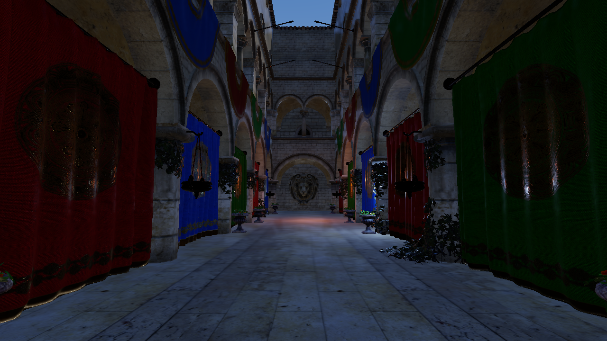

# Metal 깜빡임 — Windows 레퍼런스 이미지 & 비교 시점

Metal 전용 Sponza GI/반사 깜빡임의 **시각 검증 기준**. 아래 이미지는 동일 시점·동일 씬을
**D3D12(Windows)에서 렌더한 수렴된 안정 프레임**이다(정지 카메라 64프레임 워밍업 후, 깜빡임 없음).
Metal의 같은 시점 출력이 이 이미지처럼 **정지 상태에서 안정**되면 정상이고, 프레임마다 흔들리면(특히
바닥 반사 + 배너/기둥 GI) 아직 잔여 버그.

> **수정 랜딩됨**: Metal 깜빡임 수정 2건이 main에 올라옴 — `8424800`(rhi-metal: 명시적 MTLFence
> cross-encoder 해저드 동기 = ping-pong storage-buffer write→read 가시성 = 미수렴 근본원인) +
> `e99a840`(shader: GI/reflect `ground_albedo+cone_k` float4-pack = Metal push 레이아웃 정정). 이 doc은
> 이제 그 수정이 실제로 18.8→안정으로 잡혔는지 **Metal에서 재측정·시각확인**하는 기준이다.

## 시점 / 카메라 (정확히 이 값으로 재현)
- 씬: `SCENE_GLTF=assets/Sponza/Sponza.gltf`
- `CAM_EYE = -9, 0.8, -0.3` (아트리움 내부, 거의 눈높이)
- `CAM_TARGET = 6, 2.2, -0.3` (네이브를 따라 정면 응시)
- 해상도 1280×720, RenderQuality 미설정(=Med), 워밍업 후 정지(`CAPTURE_SEQ_STEP=0`).

## 레퍼런스 (D3D12, 안정)


> **밝기 주의 — 이 레퍼런스가 어두운 건 정상(조명 차이, 렌더 회귀 아님)**: 이 하니스는 `SCENE_GLTF`
> 모드라 **디폴트 디렉셔널 sun만** 있고 레벨의 저작 점광원이 없어 실내가 GI 바운스에만 의존 → 어둡다
> (평균 luma ≈29). 같은 카메라의 `LEVEL=sponza`(저작 sun+횃불/브라지어 점광원)는 luma ≈47로 환하다.
> 측정 확인: 현재 SCENE_GLTF 28.78 vs **풀 레거시**(cone0/div2/clamp hard) 28.88 = **GI clamp/div3/cone-trace
> 변경은 밝기 중립**(어둡게 만든 적 없음). 시각/조명 평가는 `LEVEL=sponza`, 깜빡임 디버깅은 이 SCENE_GLTF 하니스.

## 재현 명령
```bash
# 단일 클린 스크린샷 (이 이미지)
SCENE_GLTF=assets/Sponza/Sponza.gltf CAM_EYE="-9,0.8,-0.3" CAM_TARGET="6,2.2,-0.3" \
  cargo run -p sandbox -- --backend metal --screenshot-clean shot.png      # macOS
  # Windows: --backend d3d12 | vulkan

# 깜빡임 정량화 (정지 연속 6프레임 → 프레임간 평균차)
SCENE_GLTF=assets/Sponza/Sponza.gltf CAM_EYE="-9,0.8,-0.3" CAM_TARGET="6,2.2,-0.3" \
  CAPTURE_SEQ=6 CAPTURE_SEQ_STEP=0 \
  cargo run -p sandbox -- --backend metal --screenshot-clean seq.png
```
```python
import numpy as np, glob
from PIL import Image
im=[np.asarray(Image.open(f).convert('RGB'),np.float32) for f in sorted(glob.glob('seq.*.png'))]
print([round(float(np.abs(im[i]-im[i-1]).mean()),3) for i in range(1,len(im))])  # 0-255 연속프레임차
```

## 측정된 깜빡임 (이 시점, 0-255 연속프레임 평균차)
| config | **D3D12** | **Vulkan** | **Metal (수정 前 250816b)** |
|---|---:|---:|---:|
| 기본 (GI+반사) | **0.025** | **0.025** | 18.8 |
| 반사 OFF / GI ON (`P11_LEGACY_IBL=1 P11_GDF_GI=1`) | **0.008** | **0.008** | 1.67 |
| 둘 다 OFF (`P11_LEGACY_IBL=1`) | 0.000 | 0.000 | 0.000 |

(Metal 열은 수정 `8424800`/`e99a840` 前 값. 수정 후 Metal 재측정해 DX/VK의 0.008·0.025에 수렴했는지 채울 것.)

- DX·VK는 정지 시 GI temporal이 0.008로 수렴(반사 증폭돼도 0.025) → 위 레퍼런스처럼 안정.
- Metal만 GI가 1.67(200×) 미수렴 → 반사 피드백으로 18.8 증폭. **Metal-전용 백엔드 버그**(알고리즘은
  DX/VK에서 정상). 목표 = Metal을 0.008(GI-only)·0.025(기본)로 맞춤.
- 진단·수정 가이드: 별도 프롬프트 + `docs/lumen-parity-swrt.md`("깜빡임 조사 + GI temporal clamp 수정").
