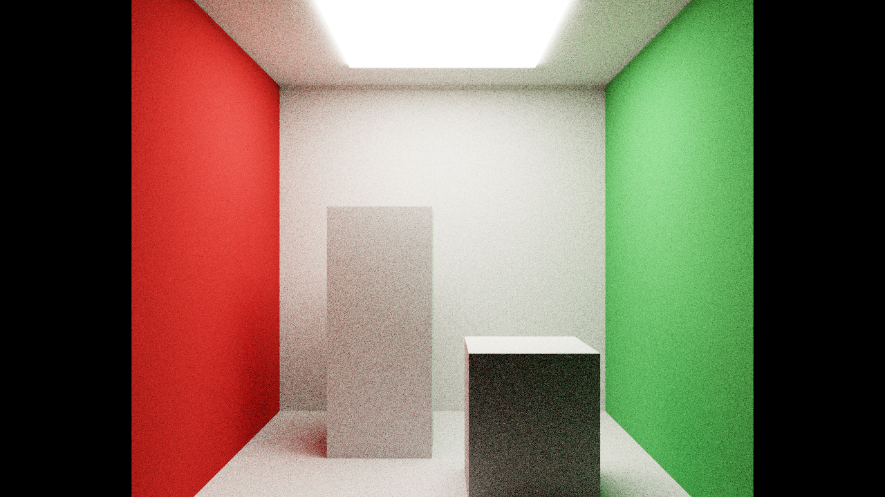
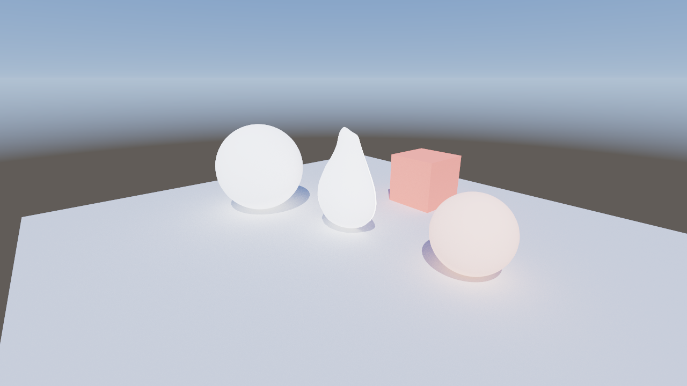

# Phase 8 — 레이트레이싱 세부 계획

> 상위 로드맵: [ROADMAP.md](ROADMAP.md). **상태: ✅ 완료** (M1–M6, 두 백엔드 검증). 검증 결과는 아래 [검증 결과](#검증-결과-m1m6) 참조.
> 전제: [Phase 7](phase-7-compute.md) ✅ (컴퓨트/GPU-driven, 바인드리스 storage, async compute) + [Phase 6](phase-6-pbr.md) ✅ (디퍼드 G-buffer, IBL). Phase 8은 Phase 10(Virtual Geometry)과 무관하게 독립적인 하드웨어 RT 트랙이다.

## Context

지금까지 렌더러는 래스터라이즈 전용이다(디퍼드 G-buffer + 그림자 맵 + split-sum IBL). Phase 8은
**하드웨어 가속 레이트레이싱**을 처음 도입한다: 가속 구조(BLAS/TLAS) 빌드, TLAS를 셰이더에서 트레이스,
그리고 그 결과로 **간단한 패스트레이서**(경로 추적 전역 조명)를 만든다.

**핵심 리스크 (ROADMAP)**: *"RT 추상화 — SBT 레이아웃·AS 빌드 인터페이스의 두 API 공통화 난이도 높음."*
DXR(D3D12)과 VK_KHR_ray_tracing(Vulkan)은 개념은 같지만 API 형태가 달라, 특히 **Shader Binding Table** 통합이
어렵다. 이 계획은 그 리스크를 **2단계로 분리**해 흡수한다(아래 결정 #1).

**개발기**: RTX 2070 SUPER — DXR Tier 1.1 + `VK_KHR_ray_query` / `VK_KHR_ray_tracing_pipeline` /
`VK_KHR_acceleration_structure` 모두 지원 확인.

**완료 기준 (ROADMAP)**: 두 백엔드에서 하드웨어 RT 결과 일치.

## 확정 사항 (사용자)

- **접근: 둘 다 — 인라인 ray query 먼저 → 풀 RT 파이프라인 + SBT.** 단계적으로 두 추상화를 모두 구축.
- **예제: 간단 패스트레이서.** 같은 패스트레이서를 두 경로(인라인/파이프라인)로 구현해 양쪽 RHI 추상화를
  검증하고, 어려운 SBT 부분을 후반 마일스톤으로 격리한다.

## 핵심 설계 결정 (제안 — 사인오프 대상)

### 1. 2단계 전략: 인라인 ray query → RT 파이프라인 + SBT (같은 패스트레이서 결과)

먼저 **인라인 ray query**(DXR 1.1 `RayQuery` / `VK_KHR_ray_query`)로 컴퓨트 셰이더 안에서 바운스를 루프 도는
패스트레이서를 만든다 — **SBT·RT 파이프라인 없이** AS 빌드 + TLAS 트레이스 + hit 셰이딩 인프라를 먼저 검증.
그 다음 **풀 RT 파이프라인 + SBT**(raygen/miss/closesthit + `DispatchRays`/`vkCmdTraceRays`)로 동일 결과를
재현해 SBT 추상화를 구축한다. 두 경로의 이미지가 일치하면 양 추상화가 정확하다는 강한 증거가 된다.
(인라인은 추상화가 단순해 RT 인프라(AS·hit 데이터 접근)를 SBT 복잡도와 분리해 안정화할 수 있다.)

### 2. 가속 구조 추상화 (AS)

- **`Blas`**(bottom-level): 메시 1개(불투명 삼각형)에서 빌드. 입력 = 정점 버퍼(위치) + 인덱스 버퍼 + 정점 수/포맷.
- **`Tlas`**(top-level): 인스턴스 배열(각 `{blas, transform(3x4), instance_custom_index, mask}`)에서 빌드.
- **빌드 인터페이스**: `Device::accel_prebuild_sizes(desc)` → `{accel_size, scratch_size}`; `RaytracingScene`이
  AS 버퍼 + 스크래치 버퍼를 소유. `CommandBuffer::build_blas`/`build_tlas`(빌드 후 AS 배리어).
  - **Vulkan**: `VK_KHR_acceleration_structure`. AS 버퍼는 `ACCELERATION_STRUCTURE_STORAGE` usage +
    **buffer device address**(BDA). `vkCmdBuildAccelerationStructuresKHR`.
  - **D3D12**: `ID3D12Device5::GetRaytracingAccelerationStructurePrebuildInfo`,
    `ID3D12GraphicsCommandList4::BuildRaytracingAccelerationStructure`. AS = `ALLOW_UNORDERED_ACCESS` 버퍼,
    GPU VA로 참조.
- **빌드 큐**: 일단 그래픽스 큐에서 일회성 빌드(정적 씬). 동적 리빌드/리프트는 이후(async-compute 큐 활용 가능).
- 압축(compaction)·업데이트(refit)는 1차 범위 밖(정적 씬 가정) — 한계로 기록, 후속.

### 3. hit에서 지오메트리/머티리얼 접근 — **바인드리스 인스턴스 테이블** (인라인·SBT 공용)

레이가 맞은 표면을 셰이딩하려면 instance/primitive에서 정점·머티리얼을 찾아야 한다. 양 경로 공용으로
**per-instance 디스크립터 버퍼**(storage buffer)를 둔다: `{ vertex_addr, index_addr, material... }`, **instance
custom index**로 인덱싱. hit에서 primitive 인덱스 → 정점 3개 → barycentric 보간으로 normal/uv → 머티리얼 셰이딩.
- Vulkan: 정점/인덱스 버퍼를 **BDA**로 참조(`buffer_reference`), 또는 기존 바인드리스 storage-buffer 인덱스 재사용.
- D3D12: 바인드리스 storage-buffer(raw)로 동일 접근.
(엔진의 bindless-first 원칙과 일치 — Phase 7의 storage-buffer 테이블을 그대로 확장.)

### 4. TLAS를 셰이더에 바인딩

- **Vulkan**: `VK_DESCRIPTOR_TYPE_ACCELERATION_STRUCTURE_KHR`. 바인드리스 set 0에 **새 binding 5**(accel)
  추가하거나 전용 디스크립터로. 인라인(ray_query)·파이프라인 공용.
- **D3D12**: TLAS는 `RaytracingAccelerationStructure` **SRV**(`ViewDimension = RAYTRACING_ACCELERATION_STRUCTURE`,
  GPU VA 지정)로, 바인드리스 SRV 힙에 등록 → `RaytracingAccelerationStructure g_tlas[]` 또는 단일 슬롯.
- 결정: 단일 TLAS면 전용 슬롯이 단순. 바인드리스 배열로 둘지 여부는 M3에서 확정.

### 5. 패스트레이서 범위 (간단 = 디퓨즈 GI 누적)

- 카메라에서 primary ray(또는 G-buffer primary hit 재사용) → 각 hit에서 **직접광(태양 + 섀도우 레이) +
  코사인 가중 디퓨즈 바운스** N회(고정 깊이 또는 러시안 룰렛). miss → env 큐브/하늘 샘플.
- **프레임 누적**(temporal accumulation): 정적 카메라에서 프레임마다 샘플 누적 → 수렴. 카메라/씬/UI 변경 시 리셋.
  (Phase 6 멀티바운스의 누적 패턴과 동형.) 프레임당 1–수 spp.
- 디퓨즈 only 먼저(완전 BSDF·굴절·NEE는 범위 밖). 머티리얼 = base color(+emissive) 사용.
- 래스터 씬과 **나란히** 토글(ImGui "Path trace"): off = 기존 디퍼드, on = RT 패스트레이서 풀스크린.

### 6. 셰이더 (Slang → SPIR-V / DXIL)

- 인라인: `RayQuery<...>` (컴퓨트 스테이지). SPIR-V `SPV_KHR_ray_query`, DXIL `sm_6_5` 컴퓨트.
- 파이프라인: `[shader("raygeneration")]` / `("miss")` / `("closesthit")`. SPIR-V `SPV_KHR_ray_tracing`;
  DXIL은 **다중 엔트리 라이브러리**(`lib_6_3`+) → `D3D12_DXIL_LIBRARY_DESC`.
- **셰이더 빌드 리스크**: build.rs는 현재 단일 `-entry`/`-stage`. RT 파이프라인은 한 파일에 여러 엔트리(raygen/
  miss/hit) → **라이브러리 컴파일 잡** 추가 필요(slangc `-target dxil`/`spirv`로 라이브러리 emit, 엔트리별 분리
  또는 단일 라이브러리 blob). M5에서 build.rs 확장. 인라인(M3/M4)은 기존 컴퓨트 잡으로 충분.

---

## 마일스톤 (각 게이트: build + fmt + clippy `-D warnings` + 두 백엔드 + Vulkan 검증 클린 + 스크린샷)

### M1 — RT 디바이스 인프라 + 능력 게이팅 ✅

- **Vulkan**: device 확장 추가(`VK_KHR_acceleration_structure`, `VK_KHR_ray_query`,
  `VK_KHR_ray_tracing_pipeline`, `VK_KHR_deferred_host_operations`), 피처 활성(`accelerationStructure`,
  `rayQuery`, `rayTracingPipeline`, `bufferDeviceAddress`). 미지원 GPU는 비활성.
- **D3D12**: `ID3D12Device5` / `ID3D12GraphicsCommandList4` 캐스트, `CheckFeatureSupport(OPTIONS5)`로
  `RaytracingTier >= TIER_1_1` 확인.
- **파사드**: `Device::has_raytracing() -> bool`(양 백엔드 능력 통일). 버퍼에 device-address/UAV usage 확장.
- **검증**: 확장/피처 활성 + 디바이스 생성이 검증 클린, `has_raytracing()`가 RTX 2070에서 true.

### M2 — 가속 구조 (BLAS / TLAS) + 인스턴스 테이블 ✅

- **rhi-types**: `BlasDesc`, `TlasInstance`, `TlasDesc`. `BufferUsage`에 AS storage / device-address 플래그.
- **RHI**: `RaytracingScene`(AS 버퍼 + 스크래치 소유), `Device::accel_prebuild_sizes`,
  `CommandBuffer::{build_blas, build_tlas, accel_barrier}` (결정 #2).
- **인스턴스 테이블**(결정 #3): per-instance storage buffer `{vertex_addr/idx, index_addr/idx, material}`.
- **검증**: 샘플 씬(스피어/큐브/아보카도)에서 BLAS×N + TLAS 빌드가 검증 클린(빌드 VUID·D3D12 디버그 없음).
  AS는 아직 트레이스 안 함 — 빌드 성공 + 배리어까지.

### M3 — 인라인 ray query: TLAS 트레이스 검증 ✅

- TLAS를 셰이더에 바인딩(결정 #4). 컴퓨트 셰이더가 G-buffer world pos에서 카메라/태양으로 `RayQuery` 트레이스.
- **최소 검증 결과**: primary-hit instanceID 시각화 또는 **RT 섀도우**(태양으로 그림자 레이 → hit이면 그늘)를
  풀스크린 storage image에 write → 표시. (패스트레이서 전 단계 — 트레이스 경로/hit 접근이 도는지 격리 검증.)
- **검증**: 두 백엔드 동일 트레이스 결과, 검증 클린.

### M4 — 인라인 패스트레이서 (컴퓨트 + RayQuery) ✅

- 결정 #5의 패스트레이서를 **인라인 ray query**로: 카메라 레이 → 바운스 루프(직접광 + 섀도우 레이 + 디퓨즈
  바운스) → env miss → 누적 storage image. hit 셰이딩은 인스턴스 테이블(결정 #3)로 머티리얼/normal 조회.
- 프레임 누적 + 리셋(카메라/UI 변경). ImGui "Path trace" 토글 + spp/바운스/누적 표시.
- **검증**: 정적 카메라에서 수렴(노이즈 감소), 코넬-박스류 또는 샘플 씬에서 전역 조명(컬러 블리딩) 가시,
  두 백엔드 일치(고정 시드·고정 프레임 스크린샷).

### M5 — 풀 RT 파이프라인 + SBT (같은 패스트레이서) ✅

- **셰이더 빌드 확장**(결정 #6): RT 라이브러리 잡(raygen/miss/closesthit 다중 엔트리) → SPIR-V + DXIL 라이브러리.
- **RT 파이프라인 + SBT**:
  - Vulkan: `vkCreateRayTracingPipelinesKHR`, 셰이더 그룹, `vkGetRayTracingShaderGroupHandlesKHR`로 SBT 버퍼 채움,
    `vkCmdTraceRaysKHR`.
  - D3D12: `ID3D12Device5::CreateStateObject`(RT PSO), `D3D12_DISPATCH_RAYS_DESC` SBT(raygen/miss/hit 레코드),
    `ID3D12GraphicsCommandList4::DispatchRays`.
  - **파사드**: `RaytracingPipeline`, `ShaderBindingTable`, `CommandBuffer::trace_rays(w,h)` — SBT 레이아웃을
    양 API 공통화(레코드 stride/정렬 차이 흡수).
- 패스트레이서를 파이프라인 경로로 재현(raygen=카메라 레이/바운스 루프/누적, miss=sky, closesthit=머티리얼
  셰이딩+인라인 섀도우 RayQuery+다음 바운스). `MaxTraceRecursionDepth = 1`(루프는 raygen에서 재발행, 재귀 아님).
- **구현 노트 (계획 대비 변경)**:
  - **DXIL 라이브러리 프로파일은 `lib_6_5`** — 계획의 `lib_6_3`은 hit 셰이더 내 인라인 `RayQuery`를 거부한다
    (`AllocateRayQuery not valid in shader model lib_6_3`). SPIR-V는 다른 스테이지와 동일하게 `sm_6_5`
    (`-fvk-use-entrypoint-name`). `build.rs`의 `is_rt_stage()`가 RT 스테이지에서만 DXIL 프로파일을 올린다.
  - **DXIL 라이브러리 export 이름 = 언맹글 엔트리명**(`rgMain`/`msMain`/`chMain`) — hit group/SBT가 그대로 참조.
  - **SBT는 1 raygen / 1 miss / 1 hit group**, 결정 #6대로 섀도우는 인라인 RayQuery로 분리.
  - **공유 바인드리스 레이아웃**(set 0)을 RT 파이프라인에서 재사용 — Vulkan binding 3/4/5에 RAYGEN|CLOSEST_HIT|MISS
    스테이지 가시성 추가, D3D12 글로벌 루트시그는 컴퓨트 루트시그와 동형. 스토리지 배리어 스테이지를 RAYGEN까지
    확장(RT 가능 디바이스 한정)해 raygen UAV 쓰기의 동기화 갭을 닫음.
  - **파사드**: `RaytracingPipelineDesc`/`RaytracingPipeline` + `CommandBuffer::{bind_raytracing_pipeline,
    push_constants_rt, trace_rays(w,h)}`. 푸시상수/누적 버퍼/출력 storage image는 인라인 경로와 동일하게 공유.
- **검증**: 파이프라인 결과가 인라인 결과와 픽셀 근사 일치, 두 백엔드 일치, 검증 클린 — 아래 [검증 결과](#검증-결과-m1m6).

### M6 — 마무리 ✅

- 인라인 vs 파이프라인 토글(ImGui "  - pipeline + SBT (vs inline)" + `P8_PATHTRACE_PIPELINE`)은 M5에서 동봉.
- `docs/phase-8-raytracing.md` 검증/한계 채움, `docs/ROADMAP.md` Phase 8 → ✅, 백로그 메모리 갱신, 커밋.
- 전 백엔드 build + fmt + clippy(`-D warnings`) + Vulkan 검증 클린, 스크린샷 두 백엔드 일치.

---

## 검증 결과 (M1–M6)

RTX 2070 SUPER, 디버그 빌드(검증 레이어 on). 패스트레이서는 누적 64프레임 고정(`PATHTRACE_WARMUP`),
고정 카메라/시드. 인라인 = 컴퓨트 RayQuery, 파이프라인 = raygen/miss/closesthit + SBT.

| 비교 | 야외 씬(sky+sun+shadow+GI) | Cornell 박스(emissive GI) |
|---|---|---|
| 파이프라인 ≈ 인라인 (Vulkan) | avg 0.0003/채널, max 5 | avg 0.0008/채널, max 14 |
| 파이프라인 ≈ 인라인 (D3D12) | avg 0.0002/채널, max 5 | — |
| **VK ≡ DX (파이프라인)** | avg 0.0002/채널, max 5 | **avg 0.0000/채널, max 1** |
| VK ≡ DX (인라인, 기준선) | avg 0.0003/채널, max 5 | — |

- 두 경로 결과가 인라인 교차백엔드 기준선과 동일한 수준으로 일치 → 두 RHI RT 추상화(인라인/파이프라인)가
  모두 정확함을 강하게 시사.
- **Vulkan VUID 0**(AS 빌드 / ray_query / ray_tracing_pipeline / SBT / device-address / RT 스테이지 배리어),
  **D3D12 디버그 클린**(state object / DispatchRays / SBT, live-object 없음).
- 회귀: 래스터 + 파티클 + 컴퓨트 포스트(비-RT 경로) 검증 클린 — 바인드리스 스테이지 플래그 추가·배리어 확장이
  기존 경로에 영향 없음.
- `cargo build` + `cargo fmt --all` + `RUSTFLAGS="-D warnings" cargo clippy --workspace --all-targets` 클린.

### 스크린샷 (풀 RT 파이프라인 경로, Vulkan)

Cornell 박스 — 발광 천장 1개로만 조명되는 폐쇄 공간. 적/녹 벽이 박스·바닥으로 번지는 컬러 블리딩(디퓨즈
전역 조명)과 소프트 섀도우가 raygen/closesthit 바운스 루프로 형성된다(인라인 경로와 픽셀 근사 일치):

야외 샘플 씬 — 태양(섀도우 레이) + 하늘(miss) + 디퓨즈 바운스 GI:

### 노출 & 태양 처리 (과노출 개선)

물리적으로 밝은 하늘 반구 + 태양을 그대로 ACES에 넣으면 흰색으로 날아간다. 상용 엔진(카메라 노출 +
필믹 톤맵)을 따라 두 가지를 적용:

- **카메라 노출을 톤맵 전에 적용** — 패스트레이서는 누적 버퍼에 **물리 radiance**를 그대로 쌓고, 표시 단계
  (`post.slang`)에서 `exposure`를 곱한 뒤 ACES 필믹 커브를 통과시킨다. (래스터 경로는 노출을 라이팅 패스에서
  이미 굽기 때문에 톤맵에는 1.0을 넘기고, 패스트레이서 출력만 여기서 노출한다.) 노출은 ImGui 슬라이더로 조정.
- **태양 디스크는 1차(카메라) 광선에만** — 디퓨즈 바운스는 태양을 **분석적 직접광**(섀도우 레이 NEE)으로만
  받는다. 바운스가 하늘의 밝은 태양 디스크를 다시 샘플하면 태양이 이중 계산되고 파이어플라이가 생기므로,
  miss의 태양 디스크는 `primary` 광선일 때만 더한다(표준적인 "디퓨즈에 태양은 델타 광" 처리).

## 검증 전략 (전 마일스톤 공통)

- `cargo fmt --all`, `RUSTFLAGS="-D warnings" cargo clippy --workspace --all-targets` clean.
- 두 백엔드 `--backend vulkan|d3d12` + `--screenshot[-clean]` → Read로 시각 확인, 누적은 고정 프레임 수로 캡처.
- `VK_LOADER_LAYERS_DISABLE="~implicit~"` Vulkan 검증 클린: AS 빌드, ray_query/ray_tracing_pipeline, SBT,
  device-address 사용에서 VUID 없음. D3D12 디버그 레이어 + GPU-based validation 클린.
- 리포지토리 주석/문서에 **타사 엔진/상표명 미사용**(사용자 라이선스 요구) — 표준 기법명으로 기술.
- 헤드리스 토글: `P8_PATHTRACE`(인라인) / `P8_PATHTRACE_PIPELINE`(SBT) 환경변수로 초기 on.

## 위험 / 주의

- **SBT 공통화(M5)** 가 최대 난점 — 인라인(M3/M4)으로 AS·hit 인프라를 먼저 안정화한 뒤 진입(결정 #1).
- **셰이더 빌드 다중 엔트리 라이브러리**(결정 #6) — slangc의 RT 라이브러리 emit 동작 확인 필요(M5 진입 전 소규모 PoC).
- **누적 결정성**: 두 백엔드 픽셀 일치를 위해 RNG 시드·바운스 순서·프레임 수를 고정. Y-flip/좌표계 차이가
  레이 방향에 들어오지 않도록 주의(Phase 7 컬링에서처럼 좌표계 통일).
- **BDA / GPU VA**: 정점·인덱스·AS 주소 접근의 양 API 모델 차이 — 인스턴스 테이블(결정 #3)로 흡수.

## 알려진 한계 / 이후 작업 (예정)

- 정적 씬 가정(AS 빌드 일회성) — 동적 리빌드/refit·압축은 후속.
- ~~디퓨즈 GI only~~ → **해소**: 후속 트랙 [rt-pbr-parity.md](rt-pbr-parity.md)에서 풀 metallic-roughness PBR
  (Cook-Torrance + VNDF IS + NEE + 러시안 룰렛 + 디스크 태양광 + 텍스처/노멀맵)로 확장, 무편향 Ground-Truth화.
  남은 한계(MIS·포인트광·굴절·디노이즈)는 그 문서 참조. 디노이즈 없음(누적 의존)은 유지.
- RT 파이프라인은 단순 SBT(1 raygen / 1 miss / 1 hit group) — 머티리얼별 hit 그룹·다중 miss는 후속.
- (이월) 런타임 Slang 리플렉션/핫리로드 — 빌드타임 임베드 유지.
