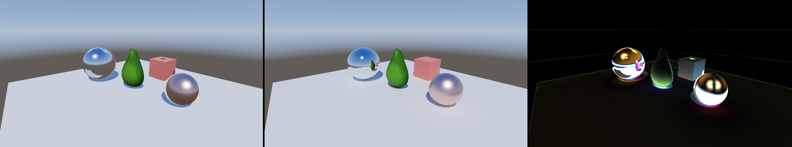

# 패스트레이서 정밀화 — Ground-Truth PBR 계획

> 상위: [phase-8-raytracing.md](phase-8-raytracing.md) (Phase 8 ✅). **상태: ✅ 완료 — G1~G5 전부.**
> 후속 트랙으로, Phase 8의 "디퓨즈 GI only" 한계를 해소한다.
> 공유 PT 코드는 `crates/shader/shaders/rt_common.slang`(rt_path/rt_pipeline가 include) — 인라인≡파이프라인 비트 동일 유지.

## 목표 (사용자 확정)

1. **패스트레이서를 향후 작업의 Ground Truth(레퍼런스)로 만든다 — 최대한 정밀·무편향(unbiased).**
   래스터(디퓨즈+split-sum IBL 근사)가 이 결과를 향해 수렴해야 하며, 패스트레이서가 정답이다.
2. **래스터와 같은 PBR 머티리얼 모델**(glTF metallic-roughness)을 써서 두 렌더러를 직접 비교 가능하게 한다.
   반사·금속/거칠기 응답·정반사가 물리적으로 정확히 나오도록(반사, PBR 반영).

**비-목표(명시)**: 실시간 성능 최적화·디노이즈는 범위 밖(누적 수렴 의존). 굴절/투명·SSS·볼류메트릭은 후속.

## 현재 격차 (패스트레이서 vs 래스터 PBR)

| 항목 | 래스터 `pbr.slang` | 패스트레이서 (현재) | 목표 |
|---|---|---|---|
| BRDF | Cook-Torrance (GGX D / Smith G / Schlick F) | Cook-Torrance + GGX VNDF | 동일 Cook-Torrance + 정반사 |
| 머티리얼 | base_color·metallic·roughness·ao·emissive (+텍스처) | metallic-roughness + base/mr/normal/emissive 텍스처 | 전체 metallic-roughness |
| 금속/정반사 | F0=lerp(0.04,albedo,metallic), 정반사 IBL | GGX 정반사 로브 | GGX 정반사 로브 → **실반사** |
| 간접광 | split-sum IBL(근사 큐브) | 디퓨즈 바운스 | **경로추적 GI/반사(정답)** |
| 직접광 | 태양(PCF 섀도우)+포인트광 | 태양(섀도우 레이)만 | 태양(디스크)+포인트광 NEE+MIS |
| 노멀 | 화면공간 미분 TBN + 노멀맵 | 삼각형 pos/UV 기반 hit-time TBN + 노멀맵 | 탄젠트 노멀맵(텍스처 머티리얼) |
| 텍스처 | base/mr/normal/emissive 샘플 | hit UV 보간 + 레이콘 LOD `SampleLevel`(전체 밉 체인) | hit에서 UV 보간 후 샘플 |
| 추정기 | — | 코사인 바운스, 고정 4바운스 | **MIS + 러시안룰렛 + 디스크광** |

핵심: 정점 레이아웃 32B에 **UV가 이미 포함**(offset 24)되어 hit에서 텍스처 샘플 가능. 탄젠트는 없음 →
삼각형 3정점(pos+uv)으로 hit에서 계산하거나 별도 버퍼. 인스턴스 테이블은 현재 64B 레코드로 확장됨.

## 마일스톤 (각 게이트: build+fmt+clippy `-D warnings` + 두 백엔드(VK≡DX) + Vulkan VUID 0 + 인라인≡파이프라인 + 스크린샷; 인라인/파이프라인 두 경로 동시 갱신)

### G1 — 머티리얼 데이터 패리티 ✅ (커밋됨)
- 인스턴스 테이블 레코드 확장: `{ vtx, idx, base_color(rgb)+? , metallic, roughness, emissive, ao, tex 인덱스[base,mr,normal,emissive] }`.
  현재 32B → 48~64B로. 호스트 패킹(`build_pt_instance_table`) + 셰이더 `Instance` 구조 동시 갱신.
- 샘플 씬·Cornell 양쪽에서 `SceneObject`의 metallic/roughness/텍스처를 그대로 채운다.
- **검증**: hit에서 머티리얼을 읽어 metallic/roughness 디버그 시각화(예: roughness를 그레이로) → 두 백엔드 일치.

### G2 — 마이크로페이싯 BSDF + 중요도 샘플링 (반사 등장) ✅ (커밋됨)
> 구현 완료: 정확한 Smith-GGX G1(래스터 근사 아님), GGX VNDF 정반사 IS(가중 F·G1(l)), 코사인 디퓨즈,
> Fresnel 가중 로브 선택, 태양 NEE=풀 BSDF. 검증: 인라인≡파이프라인 avg≤0.0005·VK≡DX avg≤0.0004·검증 클린.
> 참고: PT 금속이 래스터보다 덜 쨍한 것은 물리(밝은 흰 바닥/하늘 정확 반사) vs 래스터 IBL 근사 차이(정상).
- 래스터와 **동일한** D(GGX)/G(Smith, height-correlated)/F(Schlick) 평가. `F0=lerp(0.04,base,metallic)`,
  `diffuse=(1-metallic)*base/π`. 에너지 보존(kd=(1-F)(1-metallic)).
- 바운스 샘플링: **GGX VNDF**(visible normal) 정반사 + 코사인 디퓨즈, Fresnel 가중 로브 선택, 정확한 pdf 반환.
- 직접 태양광은 풀 BSDF로 평가(half-vector 정반사 포함). → 크롬/구리 구가 **씬·하늘을 실제로 반사**.
- **검증**: 금속(거칠기 0.08)·거친 금속·유전체 구 비교, 래스터의 IBL 반사와 **시각적으로 일관**(정답은 더 정확).
  인라인≡파이프라인, VK≡DX.

### G3 — 무편향 추정기 정밀화 (Ground Truth 핵심) ✅ (커밋됨)
- **러시안 룰렛** ✅ — `RR_START_BOUNCE`(3) 이후 throughput 기반 확률 종료, `MAX_BOUNCES` 4→8.
  무편향으로 깊은 경로 허용. (상수는 rt_common.slang에 공유.)
- **태양 디스크 광원** ✅ — `sample_cone`으로 sun 콘(반각 ~1.1°, `SUN_COS_MAX`) 내 방향을 NEE 샘플 →
  물리적 소프트 섀도우. 디스크 복사휘도 L·Ω = pc.sun.w라 기여 = eval_bsdf·sun.w·ndl(에너지 보존).
- RNG 순서 인라인≡파이프라인 동일 유지(바운스당 NEE 콘 2 + BSDF 3 + RR 1; 파이프라인은 chMain이 5,
  rgMain이 RR 1 소비). 파이어플라이 클램프 없음(무편향).
- **검증 ✅**: 인라인≡파이프라인 avg≤0.0010, VK≡DX avg≤0.0010, Cornell VK≡DX 0.0000, Vulkan VUID 0,
  소프트 섀도우 가시(접촉 그림자 페넘브라).
- **이월(G5/후속)**: MIS(BSDF↔광원)는 편향이 아닌 분산 저감이라 누적 수렴으로 대체 — 글로시 태양 하이라이트
  노이즈가 거슬리면 추가. 포인트광 NEE도 후속(현재 태양+하늘+발광만).

### G4 — 텍스처 머티리얼 + 노멀 매핑 ✅ (Metal inline + M7 검증됨)
- hit에서 보간 UV로 base_color(sRGB)·metallic-roughness(linear)·emissive 텍스처를 샘플한다.
  ~~RT 셰이더는 파생값이 없어 mip0 `Texture2D.Load` 기반 샘플러를 쓴다.~~ **(후속 해소, `bfce4e8`)**
  텍스처가 전체 밉 체인을 갖도록 바뀌었고(`rhi_types::generate_mip_chain`이 CPU에서 박스 다운샘플 —
  sRGB는 선형공간 평균, 백엔드 간 바이트 동일), RT 경로는 파생값 대신 **레이콘 LOD**(Akenine-Möller
  평면 근사: 1차 레이는 픽셀 각폭, 바운스마다 거칠기로 콘이 넓어짐)를 명시 LOD로 넘겨
  `g.textures[i].SampleLevel(g.samp, uv, lod)`로 샘플한다. 콘 상태는 inline=루프 로컬, pipeline=Payload
  필드로 운반해 두 경로가 일치. Metal M7도 root signature에 s0,space1 정적 trilinear 샘플러를 추가.
- 탄젠트: 삼각형 3정점(pos+uv)에서 hit-time 계산 → 탄젠트공간 노멀맵 적용(아보카도 모델이 노멀맵 보유).
- Metal Shader Converter M7은 별도 descriptor table에 sampled texture/cube/storage/TLAS 범위를 채운다.
  검증: `cargo check -p dreamcoast-shader`, `cargo check -p sandbox`,
  `cargo clippy -p rhi -p sandbox --all-targets`, Metal inline/M7 screenshot, M7 validation layer clean.

### G5 — 검증 + 문서화 ✅ (커밋됨)
- **나란히 비교 하니스**: `tools/rt-compare.py RASTER.png PT.png OUT.png` → `래스터 | 패스트레이서 | 차이×4`
  몽타주 + 픽셀 차이 통계(평균/최대/임계 초과 비율). 같은 고정 카메라로 캡처(헤드리스 `--screenshot-clean`):
  ```
  NO_POINT_LIGHTS=1 cargo run -p sandbox -- --backend vulkan --screenshot-clean tmp/raster.png  # 래스터(공정 비교)
  P8_PATHTRACE=1 cargo run -p sandbox -- --backend vulkan --screenshot-clean tmp/pt.png          # PT(수렴)
  python tools/rt-compare.py tmp/raster.png tmp/pt.png docs/images/rt-vs-raster.png
  ```



- **공정 비교를 막던 두 차이를 먼저 제거**(노출 아님):
  1. **포인트광** — 래스터는 포인트광 2개가 기본 ON, PT엔 없음. `NO_POINT_LIGHTS=1`로 끄면 전반적
     밝기차(>8 비율)가 22%→10%로 급감. (PT에 포인트광 NEE 추가는 후속.)
  2. **PT 발광 버그** — 샘플 씬 객체의 `base_color.a`(=불투명 알파, 1.0)가 발광 스케일로 쓰여 **모든 객체가
     자기 base_color를 발광** → 크롬 구가 거울이 아니라 흰 발광구로 보였음. 호스트에서 샘플 객체의 a=0으로
     수정(Cornell 라이트의 a는 유지). 수정 후 크롬이 정상 금속 거울이 됨.
- **비교 결과 (수정 후, 포인트광 OFF, 동일 카메라)**: 평균 절대차 **4.0/채널**(이전 9.1), >8 **6.4%**, >32 **2.7%**.
  카메라/배경/위치 완전 정렬(PT 카메라 = 래스터 `view_proj` 역행렬). 남은 차이는 **금속 구 반사**가 대부분:
  래스터 split-sum IBL 큐브(이웃 객체 미반영, 매끈) vs PT 실제 광선추적 반사(아보카도·큐브가 정확히 비침) →
  **PT가 정답**, 차이 = 래스터 IBL의 근본 한계(닫으려면 하이브리드 RT 반사 필요). 디퓨즈 표면은 거의 일치.
  > **후속 채택 (2026-06-26):** 이 "하이브리드 RT 반사" 길을 공식 채택 — **Phase 11 Stage C(C5 SSR +
  > C6 GDF SW-RT 반사 + C7 하이브리드 합성)가 래스터의 IBL 스페큘러를 대체**한다. 이 잔차(평균 ~4.0/ch,
  > 대부분 금속 반사)가 줄어드는지를 `tools/rt-compare.py`로 정량 측정하는 것이 그 트랙의 성공 지표.
  > 세부: [phase-11-distance-field-gi.md](phase-11-distance-field-gi.md) Stage C.
- **양 백엔드 패리티(전 게이트 누적)**: 인라인≡파이프라인 avg≤0.0010, VK≡DX avg≤0.0010, Cornell VK≡DX 0.0000,
  Vulkan VUID 0 / D3D12 디버그 클린, build+fmt+clippy(`-D warnings`) 클린.

## 검증 / 한계 (완료 시점)

- **달성**: 패스트레이서가 래스터와 동일한 glTF metallic-roughness 머티리얼(텍스처/노멀맵 포함)을 쓰고,
  물리 정확 Cook-Torrance BSDF(정확한 Smith G)·VNDF 중요도 샘플링·NEE·러시안 룰렛·디스크 태양광으로
  **무편향 누적 레퍼런스**가 됐다. 인라인/파이프라인/Metal 세 경로 + 양 백엔드 일치.
- **한계 (후속, 의도적 범위 밖)**:
  - **MIS 없음** — BSDF↔광원 결합 다중중요도샘플링 미구현. 편향이 아니라 분산 문제(누적으로 수렴)지만,
    완전 거울+작은 태양의 정반사 하이라이트가 노이즈가 큼. 큰 면광/환경 IS 도입 시 함께 추가 권장.
  - **포인트광 미반영** — 현재 직접광은 태양(디스크)+하늘(env)+발광면. 래스터의 포인트광은 PT NEE에 미추가.
  - **단일 산란 디퓨즈/정반사만** — 굴절·투명·SSS·이방성·클리어코트·볼류메트릭 없음.
  - **디노이즈 없음** — 누적 수렴 의존(정지 카메라). 실시간 디노이저는 범위 밖.
  - **정적 씬** — Phase 8의 일회성 AS 빌드 가정 그대로(동적 리빌드/refit 없음).

## 설계 메모 / 위험
- **인라인·파이프라인 동시 유지**: 모든 BSDF/샘플링 코드는 두 셰이더(`rt_path.slang`/`rt_pipeline.slang`)에
  동일 적용. 공유 헬퍼를 `bindless.slang` 인접 인클루드(예: `rt_common.slang`)로 묶어 중복/드리프트 방지 검토.
- **푸시상수/페이로드 예산**: 파이프라인 페이로드가 커질 수 있음(현재 max_payload 64B). BSDF 상태는 raygen 루프가
  들고 페이로드는 최소(hit 결과)만 → 64B 내 유지 목표, 필요 시 상향(RTX 2070 여유).
- **결정성·이식성**: VNDF/MIS 도입 시에도 PCG 시드·로브 선택 순서를 양 API 동일하게 고정(Phase 8에서 VK≡DX 유지 실적).
- **스토리지 버퍼 예산**: 인스턴스 테이블 1개 확장이라 영향 적음(~34/64 사용).
- **정답 정의**: "무편향 + 충분 수렴"이 기준. 클램프/디노이즈 같은 편향 도구는 기본 비활성(레퍼런스 무결성).

## 제안 진행 순서
G1 → G2(여기서 반사가 등장, 가장 큰 체감) → G3(무편향 정밀화) → G4(텍스처/노멀) → G5(검증·문서).
G2까지만으로도 "반사·PBR 반영" 1차 목표 충족. G3가 "Ground Truth" 정밀성의 핵심. G4는 텍스처 모델 완성.
